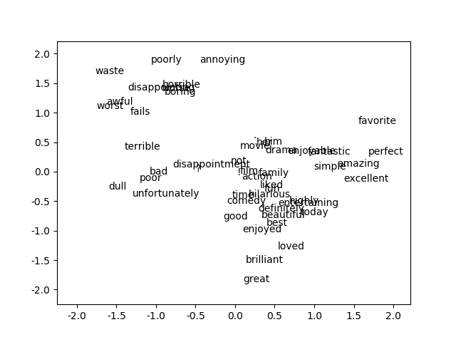

[TOC]

# one-hot 存在问题

对于类别的特征，通常会用one-hot编码，以便将每个稀疏向量表示为数字向量，以便在语义上相似的项在向量空间中具有相似的距离。但one-hot存在的问题是：

## one-hot导致稀疏向量矩阵巨大

巨大的输入向量会导致神经网络中超大的数量的矩阵权重。如果你的词汇表中有M个单词，并且输入上的网络的第一层中有N个节点，则您需要使用MxN个权重来训练该层。 大量的权重会导致进一步的问题：

- 数据量：模型中的权重越多，有效训练需要的数据就越多。

- 计算量：权重越多，训练和使用模型所需的计算量就越多。 很容易超出硬件的能力

## 向量间缺少有意义的关系

# Embedding 解决的核心问题

Embedding解决的是将大型高维稀疏向量矩阵转换为保留语义关系的低维空间。即通过将高维数据映射到低维空间来解决稀疏输入数据的核心问题。

## 代码实践 （TODO）

- 目标

目标：通过电影评论的数据集 [ACL 2011 IMDB dataset](http://ai.stanford.edu/~amaas/data/sentiment/) 训练一个语义分析模型来预测影评是喜欢(label=1)还是不喜欢(label=0)。

- 数据集

数据集是电影的影评和评分，每个电影有个唯一id和对应评分，文件形式：id_score.txt，内容是影评。
原始数据集包括了train和test两个目录，train下面的neg目录表示负样本，其中评分score<=4，label为0；pos目录表示正样本，其中评分score>=7，label为1；
其中用的数据已经转换为tfrecord格式数据了.

[train.tfrecord](https://download.mlcc.google.com/mledu-datasets/sparse-data-embedding/train.tfrecord)

[test.tfrecord](https://download.mlcc.google.com/mledu-datasets/sparse-data-embedding/test.tfrecord)

- 线性模型实现

```python
from __future__ import print_function

import os
import collections
import io
import math

import numpy as np
import pandas as pd
import tensorflow as tf

project_path = os.path.dirname(__file__)
train_path = os.path.join(project_path, 'train.tfrecord')
test_path = os.path.join(project_path, 'test.tfrecord')

print("train_path: ", train_path)
print("test_path: ", test_path)


def _parse_function(record):
    """Extracts features and labels.
    Args:
      record: File path to a TFRecord file
    Returns:
      A `tuple` `(labels, features)`:
        features: A dict of tensors representing the features
        labels: A tensor with the corresponding labels.
    """
    features = {
      "terms": tf.VarLenFeature(dtype=tf.string),   # terms are strings of varying lengths
      "labels": tf.FixedLenFeature(shape=[1], dtype=tf.float32)   # labels are 0 or 1
    }

    parsed_features = tf.parse_single_example(record, features)

    terms = parsed_features['terms'].values
    labels = parsed_features['labels']

    return {'terms': terms}, labels


# Create an input_fn that parses the tf.Examples from the given files,
# and split them into features and targets.
def _input_fn(input_filenames, num_epochs=None, shuffle=True):

    # Same code as above; create a dataset and map features and labels.
    ds = tf.data.TFRecordDataset(input_filenames)
    ds = ds.map(_parse_function)

    if shuffle:
      ds = ds.shuffle(10000)

    # Our feature data is variable-length, so we pad and batch
    # each field of the dataset structure to whatever size is necessary.
    ds = ds.padded_batch(25, ds.output_shapes)

    ds = ds.repeat(num_epochs)

    # Return the next batch of data.
    features, labels = ds.make_one_shot_iterator().get_next()
    return features, labels


# 50 informative terms that compose our model vocabulary
informative_terms = ("bad", "great", "best", "worst", "fun", "beautiful",
                     "excellent", "poor", "boring", "awful", "terrible",
                     "definitely", "perfect", "liked", "worse", "waste",
                     "entertaining", "loved", "unfortunately", "amazing",
                     "enjoyed", "favorite", "horrible", "brilliant", "highly",
                     "simple", "annoying", "today", "hilarious", "enjoyable",
                     "dull", "fantastic", "poorly", "fails", "disappointing",
                     "disappointment", "not", "him", "her", "good", "time",
                     "?", ".", "!", "movie", "film", "action", "comedy",
                     "drama", "family")


terms_feature_column = tf.feature_column.categorical_column_with_vocabulary_list(key="terms", vocabulary_list=informative_terms)
terms_embedding_column = tf.feature_column.embedding_column(terms_feature_column, dimension=2)
feature_columns = [terms_embedding_column]

my_optimizer = tf.train.AdagradOptimizer(learning_rate=0.1)
my_optimizer = tf.contrib.estimator.clip_gradients_by_norm(my_optimizer, 5.0)

classifier = tf.estimator.LinearClassifier(
  feature_columns=feature_columns,
  optimizer=my_optimizer
)

classifier.train(
  input_fn=lambda: _input_fn([train_path]),
  steps=1000)

evaluation_metrics = classifier.evaluate(
  input_fn=lambda: _input_fn([train_path]),
  steps=1000)
print("================Training set metrics:================")
for m in evaluation_metrics:
    print(m, evaluation_metrics[m])
print("------------------------------------------------------")

evaluation_metrics = classifier.evaluate(
  input_fn=lambda: _input_fn([test_path]),
  steps=1000)

print("================Test set metrics:================")
for m in evaluation_metrics:
    print(m, evaluation_metrics[m])
print("------------------------------------------------------")

"""
================Training set metrics:================
accuracy 0.77536
accuracy_baseline 0.5
auc 0.85503566
auc_precision_recall 0.84393233
average_loss 0.48445782
label/mean 0.5
loss 12.111445
precision 0.7633512
prediction/mean 0.5001644
recall 0.79816
global_step 1000
------------------------------------------------------
================Test set metrics:================
accuracy 0.77004
accuracy_baseline 0.5
auc 0.8531943
auc_precision_recall 0.84251094
average_loss 0.48546535
label/mean 0.5
loss 12.136634
precision 0.76007396
prediction/mean 0.49867472
recall 0.7892
global_step 1000
------------------------------------------------------
"""
```

- DNN 模型

```python
from __future__ import print_function
import matplotlib.pyplot as plt
import os
import collections
import io
import math

import numpy as np
import pandas as pd
import tensorflow as tf
import matplotlib

project_path = os.path.dirname(__file__)
train_path = os.path.join(project_path, 'train.tfrecord')
test_path = os.path.join(project_path, 'test.tfrecord')

print("train_path: ", train_path)
print("test_path: ", test_path)


def _parse_function(record):
    """Extracts features and labels.
    Args:
      record: File path to a TFRecord file
    Returns:
      A `tuple` `(labels, features)`:
        features: A dict of tensors representing the features
        labels: A tensor with the corresponding labels.
    """
    features = {
      "terms": tf.VarLenFeature(dtype=tf.string),   # terms are strings of varying lengths
      "labels": tf.FixedLenFeature(shape=[1], dtype=tf.float32)   # labels are 0 or 1
    }

    parsed_features = tf.parse_single_example(record, features)

    terms = parsed_features['terms'].values
    labels = parsed_features['labels']

    return {'terms': terms}, labels


# Create an input_fn that parses the tf.Examples from the given files,
# and split them into features and targets.
def _input_fn(input_filenames, num_epochs=None, shuffle=True):

    # Same code as above; create a dataset and map features and labels.
    ds = tf.data.TFRecordDataset(input_filenames)
    ds = ds.map(_parse_function)

    if shuffle:
      ds = ds.shuffle(10000)

    # Our feature data is variable-length, so we pad and batch
    # each field of the dataset structure to whatever size is necessary.
    ds = ds.padded_batch(25, ds.output_shapes)

    ds = ds.repeat(num_epochs)

    # Return the next batch of data.
    features, labels = ds.make_one_shot_iterator().get_next()
    return features, labels


# 50 informative terms that compose our model vocabulary
informative_terms = ("bad", "great", "best", "worst", "fun", "beautiful",
                     "excellent", "poor", "boring", "awful", "terrible",
                     "definitely", "perfect", "liked", "worse", "waste",
                     "entertaining", "loved", "unfortunately", "amazing",
                     "enjoyed", "favorite", "horrible", "brilliant", "highly",
                     "simple", "annoying", "today", "hilarious", "enjoyable",
                     "dull", "fantastic", "poorly", "fails", "disappointing",
                     "disappointment", "not", "him", "her", "good", "time",
                     "?", ".", "!", "movie", "film", "action", "comedy",
                     "drama", "family")


terms_feature_column = tf.feature_column.categorical_column_with_vocabulary_list(key="terms", vocabulary_list=informative_terms)
terms_embedding_column = tf.feature_column.embedding_column(terms_feature_column, dimension=2)
feature_columns = [terms_embedding_column]

my_optimizer = tf.train.AdagradOptimizer(learning_rate=0.1)
my_optimizer = tf.contrib.estimator.clip_gradients_by_norm(my_optimizer, 5.0)

classifier = tf.estimator.DNNClassifier(
  feature_columns=feature_columns,
  hidden_units=[20, 20],
  optimizer=my_optimizer
)

classifier.train(
  input_fn=lambda: _input_fn([train_path]),
  steps=1000)

evaluation_metrics = classifier.evaluate(
  input_fn=lambda: _input_fn([train_path]),
  steps=1000)
print("================Training set metrics:================")
for m in evaluation_metrics:
    print(m, evaluation_metrics[m])
print("------------------------------------------------------")

evaluation_metrics = classifier.evaluate(
  input_fn=lambda: _input_fn([test_path]),
  steps=1000)

print("================Test set metrics:================")
for m in evaluation_metrics:
    print(m, evaluation_metrics[m])
print("------------------------------------------------------")
print("embedding layer: ", classifier.get_variable_names())

embedding_matrix = classifier.get_variable_value('dnn/input_from_feature_columns/input_layer/terms_embedding/embedding_weights')
print("embedding_matrix shape: ", embedding_matrix.shape)
for term_index in range(len(informative_terms)):
    # Create a one-hot encoding for our term. It has 0s everywhere, except for
    # a single 1 in the coordinate that corresponds to that term.
    term_vector = np.zeros(len(informative_terms))
    term_vector[term_index] = 1
    # We'll now project that one-hot vector into the embedding space.
    embedding_xy = np.matmul(term_vector, embedding_matrix)
    plt.text(embedding_xy[0],
             embedding_xy[1],
             informative_terms[term_index])

# Do a little setup to make sure the plot displays nicely.
# plt.rcParams["figure.figsize"] = (15, 15)
plt.xlim(1.2 * embedding_matrix.min(), 1.2 * embedding_matrix.max())
plt.ylim(1.2 * embedding_matrix.min(), 1.2 * embedding_matrix.max())
plt.plot()
plt.savefig("./dnn_embedding.png")
# plt.show()

"""
================Training set metrics:================
accuracy 0.78492
accuracy_baseline 0.5
auc 0.86713594
auc_precision_recall 0.85690695
average_loss 0.45596382
label/mean 0.5
loss 11.399096
precision 0.7582856
prediction/mean 0.5192729
recall 0.83648
global_step 1000
------------------------------------------------------
================Test set metrics:================
accuracy 0.78272
accuracy_baseline 0.5
auc 0.86632395
auc_precision_recall 0.8545021
average_loss 0.4568605
label/mean 0.5
loss 11.421513
precision 0.7576929
prediction/mean 0.5176167
recall 0.83128
global_step 1000
------------------------------------------------------
embedding layer:  ['dnn/hiddenlayer_0/bias', 'dnn/hiddenlayer_0/bias/t_0/Adagrad', 'dnn/hiddenlayer_0/kernel', 'dnn/hiddenlayer_0/kernel/t_0/Adagrad', 'dnn/hiddenlayer_1/bias', 'dnn/hiddenlayer_1/bias/t_0/Adagrad', 'dnn/hiddenlayer_1/kernel', 'dnn/hiddenlayer_1/kernel/t_0/Adagrad', 'dnn/input_from_feature_columns/input_layer/terms_embedding/embedding_weights', 'dnn/input_from_feature_columns/input_layer/terms_embedding/embedding_weights/t_0/Adagrad', 'dnn/logits/bias', 'dnn/logits/bias/t_0/Adagrad', 'dnn/logits/kernel', 'dnn/logits/kernel/t_0/Adagrad', 'global_step']
"""
```



[深度学习中的embedding](https://blog.csdn.net/qq_35799003/article/details/84780289)

[intro_to_sparse_data_and_embeddings.ipynb](https://colab.research.google.com/notebooks/mlcc/intro_to_sparse_data_and_embeddings.ipynb?utm_source=mlcc&utm_campaign=colab-external&utm_medium=referral&utm_content=embeddings-colab&hl=en#scrollTo=HYKKpGLqLS8d)
