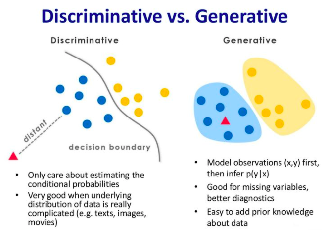
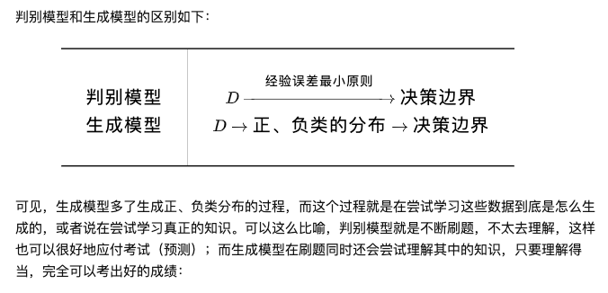
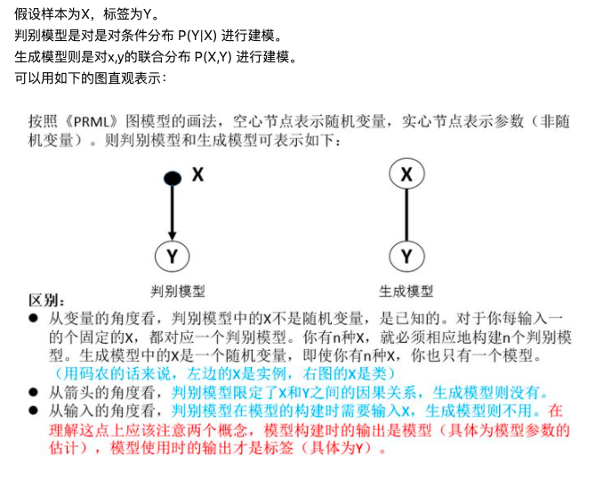

[TOC]

在机器学习中，对于有监督学习可以将其分为两类模型：判别式模型和生成式模型。简单地说，判别式模型是针对条件分布建模，而生成式模型则针对联合分布进行建模。

# 基本概念

假设我们有训练数据(X,Y)，X是属性集合，Y是类别标记。这时来了一个新的样本x，我们想要预测它的类别y。

我们最终的目的是求得最大的条件概率 P(y|x) 作为新样本的分类。

- 判别式模型这么做

直接根据X的特征，对Y进行建模，划定一个整体的判别边界。训练完模型后，会根据这个判别边界判断它应该属于哪一类。

根据训练数据得到分类函数和分界面，比如说根据SVM模型得到一个分界面，然后直接计算条件概率 P(y|x) ，我们将最大的 P(y|x) 作为新样本的分类。判别式模型是对条件概率建模，学习不同类别之间的最优边界，无法反映训练数据本身的特性，能力有限，其只能告诉我们分类的类别。

- 生成式模型这么做

会观察X和Y的整体分布，通过对每一个Y进行建模，最终会得到一个使结果最优的Y作为最终分布P(x, y)。 训练完模型后，没新来一个数据，会根据所得到的的P(x, y)和新数据的x特征，来判断y。

一般会对每一个类建立一个模型，有多少个类别，就建立多少个模型。比如说类别标签有｛猫，狗，猪｝，那首先根据猫的特征学习出一个猫的模型，再根据狗的特征学习出狗的模型，之后分别计算新样本 x 跟三个类别的联合概率 p(x, y)，然后根据贝叶斯公式：

$$P(y|x) = \frac {P(x, y)} {P(x)}$$

分别计算 P(y|x) ，选择三类中最大的 P(y|x) 作为样本的分类。

因此,
不管是生成式模型还是判别式模型，它们最终的判断依据都是条件概率P(y|x)，但是生成式模型先计算了联合概率P(x,y)，再由贝叶斯公式计算得到条件概率。

判别和生成在训练阶段的目标不同，判别模式目标在于得到一个判别边界; 而生成模型目标在于数据与标签的联合概率分布。

# 用例子说明概念

- 山羊绵羊的例子

判别式模型：要确定一个羊是山羊还是绵羊，用判别式模型的方法是从历史数据中学习到模型，然后通过提取这只羊的 特征来预测出这只羊是山羊的概率，是绵羊的概率。

生成式模型：是根据山羊的特征首先学习出一个山羊的模型，然后根据绵羊的特征学习出一个绵羊的模型，然后从这只羊中提取特征，放到山羊模型中看概率是多少，再放到绵羊模型中看概率是多少，哪个大就是哪个。

- 模型范例

假设现在有一个分类问题，X是特征，Y是类标记。用判别式模型学习一个条件概率分布 P(y|x) ，用生成式模型学习一个联合概率分布 P(x,y) 。用一个简单的例子来说明这个问题。假设X就是两个特征（1或2），Y有两类（0或1），有如下训练样本（1，0）、（1，0）、（1，1）、（2，1）。

|        | 样本1   | 样本2   | 样本3  | 样本4    |
| :-----:| :----: | :----: | :----: | :----:  |
| x      | 1      | 1       |   1   |    2    |
| y      | 0      | 0       |   1   |    1    |

则学习到的条件概率分布（判别式模型）如下：

|        | y = 0   | y = 1 |
| :-----:| :----:  | :----:|
| x=1    |   2/3   | 1/3   |
| x=2    |    0    | 1     |

$\sum_y P(y|x) = 1$

而学习到的联合概率分布（生成式模型）如下：

|        | y = 0   | y = 1 |
| :-----:| :----:  | :----:|
| x=1    |   1/2   | 1/4   |
| x=2    |    0    | 1/4   |

$\sum P(x, y) = 1$

在实际分类问题中，判别式模型可以直接用来判断特征的类别情况；而生成式模型需要加上贝叶斯公式，然后应用到分类中。但是，生成式模型的概率分布可以有其他应用，就是说生成式模型更一般更普适。不过判别式模型更直接，更简单。两种方法目前交叉较多。 由生成式模型可以得到判别式模型，但由判别式模型得不到生成式模型。

# 判别式模型和生成式模型的区别

## 判别式模型和生成式模型的对比图

上图左边为判别式模型而右边为生成式模型，可以很清晰地看到差别，判别式模型是在寻找一个决策边界，通过该边界来将样本划分到对应类别。而生成式模型则不同，它学习了每个类别的边界，它包含了更多信息，可以用来生成样本。

## 判别式模型和生成式模型的特点

- 判别式模型特点：

判别式模型直接学习决策函数 Y=F(X) 或者条件概率 P(Y|X) ，不能反映训练数据本身的特性，但它寻找不同类别之间的最优分裂面，反映的是异类数据之间的差异，直接面对预测往往学习准确度更高。具体来说有以下特点：

> 1. 对条件概率建模，学习不同类别之间的最优边界。
>
> 2. 捕捉不同类别特征的差异信息，不学习本身分布信息，无法反应数据本身特性。
>
> 3. 学习成本较低，需要的计算资源较少。
需要的样本数可以较少，少样本也能很好学习。
预测时拥有较好性能。
无法转换成生成式。

- 生成式模型的特点

而生成式模型求得P(Y,X)，对于未见示例X，你要求出X与不同标记之间的联合概率分布，然后大的获胜，如上图右边所示，并没有什么边界存在，对于未见示例（红三角）。

生成式模型的学习收敛速度更快，当样本容量增加时，学习到的模型可以更快的收敛到真实模型，当存在隐变量时，依旧可以用生成式模型，此时判别式方法就不行了。具体来说，有以下特点：

> 1. 对联合概率建模，学习所有分类数据的分布。
> 2. 学习到的数据本身信息更多，能反应数据本身特性。
> 3. 学习成本较高，需要更多的计算资源。
> 4. 推断时性能较差。
> 5. 一定条件下能转换成判别式。

总之，判别式模型和生成式模型都是使后验概率最大化，判别式是直接对后验概率建模，而生成式模型通过贝叶斯定理这一“桥梁”使问题转化为求联合概率。

从本质上来说：判别模型之所以称为“判别”模型，是因为其根据X“判别”Y；

而生成模型之所以称为“生成”模型，是因为其预测的根据是联合概率P(X,Y)，而联合概率可以理解为“生成”(X,Y)样本的概率分布（或称为 依据）；具体来说，机器学习已知X，从Y的候选集合中选出一个来，可能的样本有(X,Y_1), (X,Y_2), (X,Y_3),……，(X,Y_n),实际数据是如何“生成”的依赖于P(X,Y)，那么最后的预测结果选哪一个Y呢？那就选“生成”概率最大的那个吧~

# 二者所包含的算法

## 判别模式

- Linear Regression(线性回归)

- Logistic Regression(逻辑回归)

- SVM

- CART(Classification And Regression Tree)

- NN(神经网络)

- Gaussian Process(高斯过程)

- CRF(条件随机场)

- KNN

## 生成模式

- 朴素贝叶斯

- 混合高斯模型

- HMM(隐马尔科夫模型)

- Markov Random Fields(马尔科夫随机场)

- Sigmoid Belief Networks

- DBN(深度信念网络)

- LDA(文档主题生成模型)

# reference

[机器学习中的判别式模型和生成式模型](https://zhuanlan.zhihu.com/p/74586507)

[机器学习“判定模型”和“生成模型”有什么区别？-- 数学推导](https://www.zhihu.com/question/20446337)
