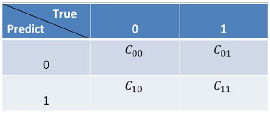

[TOC]


# 数据不均衡问题产生

样本不均衡主要是由于不同类别之间的比例差异较大，一般情况超过10倍就需要引起警觉并考虑该问题，超过20倍就要一定解决该问题。

样本不均衡问题产生的场景主要有：

- 异常检测。恶意刷单、信用卡欺诈、设备故障等，这些数据样本所占比例通常占整体样本很少一部分。

- 罕见事件分析。与异常检测类似，都属于发生个案较少；不同点是在于异常检测通常都是预先定义好的规则和逻辑，并且大多数异常都会企业运营造成负面影响；罕见事件无法预判，并且也没有明显的积极和消极影响

- 发生频率低的事件。

# 机器学习中数据不均衡问题解决

## 从数据维度解决

思想：修改数据集的分布，使得数据集能够满足标准的机器学习模型

- 是否可以扩大数据集

- 下采样

组合不同的重采样数据：若随机丢弃反例，可能丢失一些重要信息，周志华实验室提出了采用集成学习机制，将反例划分为若干个集合供不同的学习器使用，这样对每个学习器来看都进行了欠采样，但全局来看却不会丢失重要信息。

用不同的比例重采样数据：比如一个模型1:1(少数:多数)，另外一个1:3, 2:1等都是有意义的

- 上采样

- 合成数据

- 对多数类聚类

Sergey Quora提出了一种优雅的方法。他建议不要依赖随机样本来覆盖训练样本的种类，而是将r个分组中的多数类进行聚类，其中r为r中的样本数。对于每个组，只保留质心（样本的中心）。然后该模型仅保留了少数类和样本质心来训练

## 基于特征维度解决样本不均衡

一般情况下，样本不均衡也会导致特征分别不均衡；但小样本具有一定的规模，那么意味其特征分布较为均匀，可以通过选择具有显著特征

## 从模型维度解决

思想：修改标准的模型，使其适应倾斜数据的分布。

### 代价敏感学习

- 代价矩阵



数据采样从数据层面解决不平衡数据的学习问题，在算法曾名解决不平衡数据的方法主要是基于代价敏感学习算法(cost-sensitive learning)。代价敏感学习方法的核心是代价矩阵，在实际应用中不同类别的误分类的误分情况导致的代价不一样。例如在医疗中，“将病人误疹为健康人”和“将健康人误疹为病人”的代价不同；在信用卡盗用检测中，“将盗用误认为正常使用”与“将正常使用识破认为盗用”的代价也不相同，因此我们定义代价矩阵如下图5所示。标记Cij为将类别j误分类为类别i的代价，显然C00=C11=0，C01,C10为两种不同的误分类代价，当两者相等时为代价不敏感的学习问题

- 代价敏感学习方法

基于以上代价矩阵的分析，代价敏感学习方法主要有以下三种实现方式，分别是：

> 从学习模型出发，着眼于对某一具体学习方法的改造，使之能适应不平衡数据下的学习，研究者们针对不同的学习模型如感知机，支持向量机，决策树，神经网络等分别提出了其代价敏感的版本。以代价敏感的决策树为例，可从三个方面对其进行改进以适应不平衡数据的学习，这三个方面分别是决策阈值的选择方面、分裂标准的选择方面、剪枝方面，这三个方面中都可以将代价矩阵引入，具体实现算法可参考参考文献中的相关文章。

> 从贝叶斯风险理论出发，把代价敏感学习看成是分类结果的一种后处理，按照传统方法学习到一个模型，以实现损失最小为目标对结果进行调整，优化公式如下所示。此方法的优点在于它可以不依赖所用具体的分类器，但是缺点也很明显它要求分类器输出值为概率。

$H(x)=arg \displaystyle \min_{i}(\sum_{j \in \{-,+\}} P(j|x) C(i, j))$

> 从预处理的角度出发，将代价用于权重的调整，使得分类器满足代价敏感的特性，下面讲解一种基于Adaboost的权重更新策略。


论文：Learning from Imbalanced Data

### 将分类问题转换为异常点检测问题

### Algorithm-level methods

### Hybrid methods

## 从评价指标维度解决

- 给少数正类以更大的权重

- 使用AUC指标评估


# python处理样本不均衡

```bash
pip install imbalanced-learn
```

```python
import pandas as pd
from imblearn.over_sampling import SMOTE # 过抽样处理库SMOTE
from imblearn.under_sampling import RandomUnderSampler # 欠抽样处理库RandomUnderSampler
from sklearn.svm import SVC #SVM中的分类算法SVC
from imblearn.ensemble import EasyEnsemble # 简单集成方法EasyEnsemble

# 导入数据文件
df = pd.read_table('data2.txt', sep=' ', names=['col1', 'col2','col3', 'col4', 'col5', 'label']) # 读取数据文件
x = df.iloc[:, :-1] # 切片，得到输入x
y = df.iloc[:, -1] # 切片，得到标签y
groupby_data_orgianl = df.groupby('label').count() # 对label做分类汇总
print (groupby_data_orgianl) # 打印输出原始数据集样本分类分布

# 使用SMOTE方法进行过抽样处理
model_smote = SMOTE() # 建立SMOTE模型对象
x_smote_resampled, y_smote_resampled = model_smote.fit_sample(x,y) # 输入数据并作过抽样处理
x_smote_resampled = pd.DataFrame(x_smote_resampled, columns=['col1','col2', 'col3', 'col4', 'col5']) # 将数据转换为数据框并命名列名
y_smote_resampled = pd.DataFrame(y_smote_resampled,columns=['label']) # 将数据转换为数据框并命名列名
smote_resampled = pd.concat([x_smote_resampled, y_smote_resampled],axis=1) # 按列合并数据框
groupby_data_smote = smote_resampled.groupby('label').count() # 对label做分类汇总
print (groupby_data_smote) # 打印输出经过SMOTE处理后的数据集样本分类分布

# 使用RandomUnderSampler方法进行欠抽样处理
model_RandomUnderSampler = RandomUnderSampler() # 建立RandomUnderSampler模型对象
x_RandomUnderSampler_resampled, y_RandomUnderSampler_resampled =model_RandomUnderSampler.fit_sample(x,y) # 输入数据并作欠抽样处理
x_RandomUnderSampler_resampled =pd.DataFrame(x_RandomUnderSampler_resampled,columns=['col1','col2','col3','col4','col5'])
# 将数据转换为数据框并命名列名
y_RandomUnderSampler_resampled =pd.DataFrame(y_RandomUnderSampler_resampled,columns=['label']) # 将数据转换为数据框并命名列名
RandomUnderSampler_resampled =pd.concat([x_RandomUnderSampler_resampled, y_RandomUnderSampler_resampled], axis= 1) # 按列合并数据框
groupby_data_RandomUnderSampler =RandomUnderSampler_resampled.groupby('label').count() # 对label做分类汇总
print (groupby_data_RandomUnderSampler) # 打印输出经过RandomUnderSampler处理后的数据集样本分类分布

# 使用SVM的权重调节处理不均衡样本
model_svm = SVC(class_weight='balanced') # 创建SVC模型对象并指定类别权重
model_svm.fit(x, y) # 输入x和y并训练模型

# 使用集成方法EasyEnsemble处理不均衡样本
model_EasyEnsemble = EasyEnsemble() # 建立EasyEnsemble模型对象
x_EasyEnsemble_resampled, y_EasyEnsemble_resampled =
model_EasyEnsemble.fit_sample(x, y) # 输入数据并应用集成方法处理
print (x_EasyEnsemble_resampled.shape) # 打印输出集成方法处理后的x样本集概况
print (y_EasyEnsemble_resampled.shape) # 打印输出集成方法处理后的y标签集概况

# 抽取其中一份数据做审查
index_num = 1 # 设置抽样样本集索引
x_EasyEnsemble_resampled_t =pd.DataFrame(x_EasyEnsemble_resampled[index_num],columns=['col1','col2','col3','col4','col5'])
# 将数据转换为数据框并命名列名
y_EasyEnsemble_resampled_t =pd.DataFrame(y_EasyEnsemble_resampled[index_num],columns=['label']) # 将数据转换为数据框并命名列名
EasyEnsemble_resampled = pd.concat([x_EasyEnsemble_resampled_t,
y_EasyEnsemble_resampled_t], axis = 1) # 按列合并数据框
groupby_data_EasyEnsemble =EasyEnsemble_resampled.groupby('label').count() # 对label做分类汇总
print (groupby_data_EasyEnsemble) # 打印输出经过EasyEnsemble处理后的数据集样本分类分布
```


