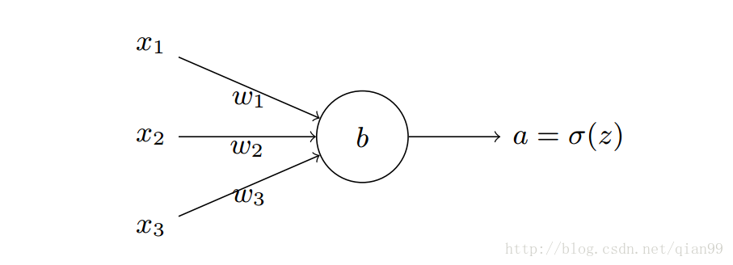

# softmax

## softmax 函数

hardmax 最大特点是只能选择其中一个最大值，即非黑即白。这种在现实中是不合情理的。实际中我们更期望得到每个类别的概率值(置信度)。所以此时用到了soft，Softmax的含义就在于不再唯一的确定某一个最大值，而是为每个输出分类的结果都赋予一个概率值，表示属于每个类别的可能性。

softmax(柔性最大值)函数，一般在神经网络中， softmax可以作为分类任务的输出层。其实可以认为softmax输出的是几个类别选择的概率，比如我有一个分类任务，要分为三个类，softmax函数可以根据它们相对的大小，输出三个类别选取的概率，并且概率和为1。



如上图一个神经元的输出示意图，输出为

$z_i=\sum_{j} w_{ij} x_{ij} + b$

其中 $z_i$ 表示第i个神经元的输出， $w_{ij}$ 是第i个神经元的第j个权重，b是偏移值。
给这个输出加上一个softmax函数，那就变成了这样：

$a_i=\frac{e^{z_i}}{\sum_k e^{z_k}}$

$a_i$代表softmax的第i个输出值，右侧就是套用了softmax函数。

- 引入指数函数的优点

指数函数曲线呈现递增趋势，最重要的是斜率逐渐增大，也就是说在x轴上一个很小的变化，可以导致y轴上很大的变化。这种函数曲线能够将输出的数值拉开距离。

- 引入指数函数的缺点

指数函数的曲线斜率逐渐增大虽然能够将输出值拉开距离，但是也带来了缺点，当 $z_i$ 值非常大的话，计算得到的数值也会变的非常大，数值可能会溢出。

解决方法:

$D = max(z)$

$softmax(z_i) = \frac{e^{z_i -D}} {\sum_{c=1}^C e^{z_c - D}}$


## softmax 损失函数

使用交叉熵作为损失函数，公式如下

$L(y, a) = - \sum_i y_i log(a_i)$

其中$y_i$表示真实的分类结果


## softmax反向传递

$\frac{\partial L(y, a)} {\partial z_i} = \sum_j ( \frac {\partial L(y, a)} {\partial a_j} \frac {\partial a_j} {\partial z_i})$

这里为什么是$a_j$而不是$a_i$，这里要看一下softmax的公式了，因为softmax公式的特性，它的分母包含了所有神经元的输出，所以，对于不等于i的其他输出里面，也包含着$z_i$，所有的a都要纳入到计算范围中，并且后面的计算可以看到需要分为 $i=j$ 和 $i \neq j$两种情况求导

$$\frac {\partial L(y_j, a_j)} {\partial L(a_j)} = \frac {\partial (- y_j log(a_j))} {\partial a_j} = - \frac {y_j} {a_j}$$

- 当 $i = j$

$\frac {\partial a_j} {\partial z_i} = \frac {\partial(\frac {e^{z_j}} {\sum_k e^{z_k}})} {\partial z_i}= \frac {\sum_k e^{z_k} e^{z_j} - (e^{z_j})^2} {(\sum_k e^{z_k})^2} = (\frac {e^{z_j}} {\sum_k e^{z_k}}) (1 - \frac {e^{z_j}} {\sum_k e^{z_k}})=a_j(1 - a_j) = a_i(1-a_i)$

- 当 $i \neq j$

$\frac {\partial a_j} {\partial z_i} = - e^{z_j} (\frac {1} {\sum_k e^{z_k}})^2 e^{z_i} = -a_ia_j$

综合起来

$\frac{\partial L(y, a)} {\partial z_i} = \sum_{i = j} ( \frac {\partial L(y, a)} {\partial a_j} \frac {\partial a_j} {\partial z_i}) + \sum_{i \neq j} ( \frac {\partial L(y, a)} {\partial a_j} \frac {\partial a_j} {\partial z_i}) = (-y_i \frac{1}{a_i})(a_i(1-a_i)) + \sum_{i \neq j} (-y_i \frac {1} {a_j})(-a_ia_j) = (-y_i(1-a_i)) + \sum_{i \neq} a_iy_j$
$=-y_i + a_iy_i + a_i\sum_{i \neq j} y_i=-y_i + a_i\sum_j y_i$


最后的结果看起来简单了很多，最后，针对分类问题，我们给定的结果$y_i$最终只会有一个类别是1，其他类别都是0，因此，对于分类问题，这个梯度等于：

$\frac{\partial L(y, a)} {\partial z_i} =a_i-y_i$


## 代码实现

```python
# 循环实现
def softmax_loss_naive(W, X, y, reg):
	"""
	Softmax loss function, naive implementation (with loops)

	Inputs have dimension D, there are C classes, and we operate on minibatches
	of N examples.

	Inputs:
	- W: A numpy array of shape (D, C) containing weights.
	- X: A numpy array of shape (N, D) containing a minibatch of data.
	- y: A numpy array of shape (N,) containing training labels; y[i] = c means
	that X[i] has label c, where 0 <= c < C.
	- reg: (float) regularization strength

	Returns a tuple of:
	- loss as single float
	- gradient with respect to weights W; an array of same shape as W
	"""
	# Initialize the loss and gradient to zero.
	loss = 0.0
	dW = np.zeros_like(W)

	num_train = X.shape[0]
	num_classes = W.shape[1]
	for i in xrange(num_train):
		scores = X[i,:].dot(W)
		scores_shift = scores - np.max(scores)
		right_class = y[i]
		loss += -scores_shift[right_class] + np.log(np.sum(np.exp(scores_shift)))
		for j in xrange(num_classes):
		 softmax_output = np.exp(scores_shift[j]) / np.sum(np.exp(scores_shift))
		 if j == y[i]:
		   dW[:,j] += (-1 + softmax_output) * X[i,:]
		 else:
		   dW[:,j] += softmax_output * X[i,:]

	loss /= num_train
	loss += 0.5 * reg * np.sum(W * W)
	dW /= num_train
	dW += reg * W
	return loss, dW
```

```python
# 使用矩阵运算,对权重 W 求导函数
def softmax_loss_vectorized(W, X, y, reg):
	"""
	Softmax loss function, vectorized version.

	Inputs and outputs are the same as softmax_loss_naive.
	"""
	# Initialize the loss and gradient to zero.
	loss = 0.0
	dW = np.zeros_like(W)

	num_train = X.shape[0]
	num_classes = W.shape[1]
	scores = X.dot(W)
	scores_shift = scores - np.max(scores, axis = 1).reshape(-1,1)
	softmax_output = np.exp(scores_shift) / np.sum(np.exp(scores_shift), axis=1).reshape(-1,1)
	loss = -np.sum(np.log(softmax_output[range(num_train), list(y)]))
	loss /= num_train
	loss += 0.5 * reg * np.sum(W * W)

	dS = softmax_output.copy()
	dS[range(num_train), list(y)] += -1
	dW = (X.T).dot(dS)
	dW = dW / num_train + reg * W  

	return loss, dW
```

# 多分类 softmax梯度求解推导

TODO

# softmax 和SVM

TODO


# LR多分类和softmax多分类

- 若分类的的类别互斥，则用softmax方法

- 若分类的类别存存在交叉，则用多分类LR，再通过投票决定


# reference

[一文详解Softmax函数](https://zhuanlan.zhihu.com/p/105722023)

[机器学习算法：LR多分类与softmax分类](https://www.jianshu.com/p/8b8cecf8836a)

[三分钟带你对 Softmax 划重点](https://blog.csdn.net/red_stone1/article/details/80687921)

[简单易懂的softmax交叉熵损失函数求导](https://blog.csdn.net/qian99/article/details/78046329)

[Softmax Linear Classifier](https://github.com/RedstoneWill/MachineLearningInAction/tree/master/Softmax)

[CS231n Convolutional Neural Networks for Visual Recognition](http://cs231n.github.io/linear-classify/#softmax)
