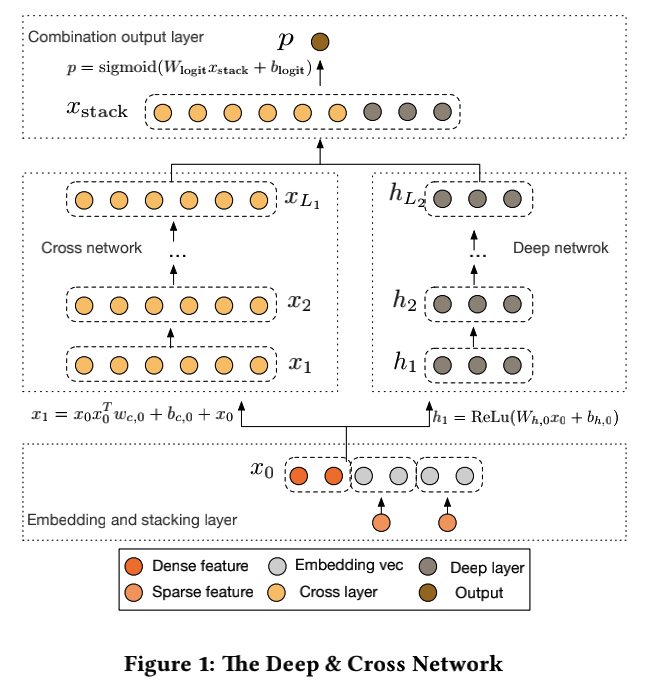

[TOC]

# 原理

DCN模型主要由三部分构成

- 输入层

主要是Embedding feature、continue feature、sparse feature三种类型特征作为输入

- 网络层

Cross network 结构

其中 x0 为 Embedding feature和continue feature。$(x_0 \in R^d)$, 第 l+1 层的 cross layer:

$x_{l+1} = x_0 x_l^T w_l + b_l + x_l$

其中 $w_l, b_l (w_l \in R^d, b_l \in R^d)$ 为第l层参数。

参数维度: $d x L_c * 2$ 其中Lc表示交叉的层数，d表示每层输入的维度

DNN 结构

- 输出层

cross layer 和 deep layer 最后做一次concat，对于二分类使用sigmod进行分类操作。

# DCN 的优势

DCN能够有效的捕获特征间的组合，学会高度非线性的相互作用;不需要人工特征工程和遍历搜索，可以近似实现高阶特征组合，并且具有较低的计算成本。
论文中的主要贡献有如下：

- 提出了一个新的交叉网络。在每一层明确的应用交叉特征，有效的学习到有界限的交叉特征，并且不需要手动的特征工程或者穷举搜索;

- 交叉网络简单并且有效。通过设计，高级多项式的度的增加取决于神经网络的层数。

- 交叉网络高效实用内存，并且易于实现

- 试验结果表明，交叉网络相比于DNN网络，在logloss上少了一个量级的参数

# 实践

# reference

[DCN(Deep & Cross Network)模型在手淘分类地图CTR预估上的应用](https://developer.aliyun.com/article/551671)

[princewen tensorflow_practice github](https://github.com/princewen/tensorflow_practice)

[推荐系统遇上深度学习(五)--Deep&Cross Network模型理论和实践](https://ask.hellobi.com/blog/wenwen/11887)

