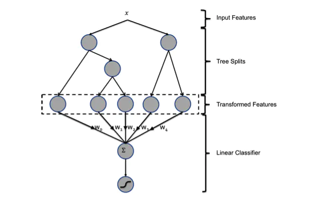

[TOC]

# GBDT + LR 融合

## 优劣比较

### LR做点击率预估优势劣势

- 优势

1. 简单

2. 并行

- 劣势

1. 大量的特征工程

> 连续特征离散化：并对离散化的特征进行one-hot 编码

> 特征组合：为取得非线性特征，需要对特征进行二阶或者三阶的特征组合

2. 特征工程存在的问题

> 连续变量切分点如何选择？以及离散化多少份合理？

> 选取哪些特征交叉？多少阶特征(2阶、三阶...)交叉

### gbdt + lr 优势

- 优势: 解决了LR的存在的问题

> 确定切分点不在根据主观经验，而是根据信息增益，客观的选取切分点和份数

> 每棵树从节点到叶子节点的路径，会经过不同的特征，此路径包含了特征组合，而且包含了二阶、三阶甚至更多

- 使用gbdt + lr的原因

> gbdt在线预测比较困难，而且训练复杂度高于LR。因此在实中，可以离线训练gbdt，然后将该模型作为在线ETL的一部分

### gbdt + lr 缺点

<font color='red'> 大量离散特征导致的高维度离散数据，这将导致树模型对这样的离散特征，是不能很好处理的，要说为什么，因为这容易导致过拟合 </font>

<font color='red'> LR 和GBDT正则惩罚不同: LR是直接对特征系数进行惩罚，而树模型是通过叶子节点和树的深度进行惩罚. </font>

假设有1w 个样本， y类别0和1，100维特征，其中10个样本都是类别1，而特征 f1的值为0，1，且刚好这10个样本的 f1特征值都为1，其余9990样本都为0(在高维稀疏的情况下这种情况很常见)，我们都知道这种情况在树模型的时候，很容易优化出含一个使用 f1为分裂节点的树直接将数据划分的很好，但是当测试的时候，却会发现效果很差，因为这个特征只是刚好偶然间跟 y拟合到了这个规律，这也是我们常说的过拟合。但是当时我还是不太懂为什么线性模型就能对这种 case 处理的好？照理说 线性模型在优化之后不也会产生这样一个式子：y = W1*f1 + Wi*fi+....，其中 W1特别大以拟合这十个样本吗，因为反正 f1的值只有0和1，W1过大对其他9990样本不会有任何影响。

后来思考后发现原因是因为现在的模型普遍都会带着正则项，而 lr 等线性模型的正则项是对权重的惩罚，也就是 W1一旦过大，惩罚就会很大，进一步压缩 W1的值，使他不至于过大，而树模型则不一样，树模型的惩罚项通常为叶子节点数和深度等，而我们都知道，对于上面这种 case，树只需要一个节点就可以完美分割9990和10个样本，惩罚项极其之小，这也就是为什么在高维稀疏特征的时候，线性模型会比非线性模型好的原因了：带正则化的线性模型比较不容易对稀疏特征过拟合。

## 算法流程



图中共有两棵树，x为一条输入样本，遍历两棵树后，x样本分别落到两颗树的叶子节点上，每个叶子节点对应LR一维特征，那么通过遍历树，就得到了该样本对应的所有LR特征。

构造的新特征向量是取值0/1的。举例来说：上图有两棵树，左树有三个叶子节点，右树有两个叶子节点，最终的特征即为五维的向量。对于输入x，假设他落在左树第一个节点，编码[1,0,0]，落在右树第二个节点则编码[0,1]，所以整体的编码为[1,0,0,0,1]，这类编码作为特征，输入到LR中进行分类。

## 实战

```python
import lightgbm as lgb

import pandas as pd
import numpy as np

from sklearn.metrics import mean_squared_error
from sklearn.linear_model import LogisticRegression

print('Load data...')
df_train = pd.read_csv('data/train.csv')
df_test = pd.read_csv('data/test.csv')

NUMERIC_COLS = [
    "ps_reg_01", "ps_reg_02", "ps_reg_03",
    "ps_car_12", "ps_car_13", "ps_car_14", "ps_car_15",
]

# print(df_test.head(10))

y_train = df_train['target']  # training label
y_test = df_test['target']  # testing label
X_train = df_train[NUMERIC_COLS]  # training dataset
X_test = df_test[NUMERIC_COLS]  # testing dataset

# create dataset for lightgbm
lgb_train = lgb.Dataset(X_train, y_train)
lgb_eval = lgb.Dataset(X_test, y_test, reference=lgb_train)

params = {
    'task': 'train',
    'boosting_type': 'gbdt',
    'objective': 'binary',
    'metric': {'binary_logloss'},
    'num_leaves': 64,
    'num_trees': 100,
    'learning_rate': 0.01,
    'feature_fraction': 0.9,
    'bagging_fraction': 0.8,
    'bagging_freq': 5,
    'verbose': 0
}

# number of leaves,will be used in feature transformation
num_leaf = 64

print('Start training...')
# train
gbm = lgb.train(params,
                lgb_train,
                num_boost_round=100,
                valid_sets=lgb_train)

print('Save model...')
# save model to file
gbm.save_model('model.txt')

print('Start predicting...')
# pred_leaf=True: predict and get data on leaves, training data
y_pred = gbm.predict(X_train, pred_leaf=True)

print(np.array(y_pred).shape)
print(y_pred[:1])

"""
# 训练数据量和树的棵树
(10000, 100)
# 每条训练数据不是gbdt的预测值，而是落在每棵树的哪个叶子节点上
[[59 45 17 17 12 12 18 11 18 18 56 12 12 12 44 42 22 24 24 24 14 39 58 15
  25  3 47  3  3  3  7  5 31 38 38 63  5 61 61 56 15  7 17 51 19 56  0 51
   0 32  2  2 36 46 34 57 48 24 52 42  2 43 62 56 55 51 24 52 16 27 53 14
  37 60 63  1 35 35 49 35 32  3 50  3  4 63 51 15 39 55 48 63 36 25 25 62
  14 26 23 12]]
"""

# 需要将每棵树的特征进行one-hot处理
# transformed_training_matrix的维度为: (N(训练样本数量), num_tress(树的棵树) * num_leafs(每棵树的叶子数))
print('Writing transformed training data')
transformed_training_matrix = np.zeros([len(y_pred), len(y_pred[0]) * num_leaf], dtype=np.int64)
# 计算每个训练样本在100棵树种的叶子索引，并transformed_training_matrix矩阵对应位置置为1
for i in range(0, len(y_pred)):
    temp = np.arange(len(y_pred[0])) * num_leaf + np.array(y_pred[i])
    transformed_training_matrix[i][temp] += 1

# 对于测试集也要进行同样的处理
y_pred = gbm.predict(X_test, pred_leaf=True)
print('Writing transformed testing data')
transformed_testing_matrix = np.zeros([len(y_pred), len(y_pred[0]) * num_leaf], dtype=np.int64)
for i in range(0, len(y_pred)):
    temp = np.arange(len(y_pred[0])) * num_leaf + np.array(y_pred[i])
    transformed_testing_matrix[i][temp] += 1

# 使用LR进行训练
lr = LogisticRegression(penalty='l2', C=0.05)   # logistic model construction
lr.fit(transformed_training_matrix, y_train)    # fitting the data
y_pred_test = lr.predict_proba(transformed_testing_matrix)   # Give the probability on each label

print(y_pred_test)
NE = (-1) / len(y_pred_test) * sum(((1+y_test)/2 * np.log(y_pred_test[:, 1]) + (1-y_test)/2 * np.log(1 - y_pred_test[:, 1])))
print("Normalized Cross Entropy " + str(NE))
```

# reference

[Practical Lessons from Predicting Clicks on Ads at Facebook 论文](https://www.semanticscholar.org/paper/Practical-Lessons-from-Predicting-Clicks-on-Ads-at-He-Pan/daf9ed5dc6c6bad5367d7fd8561527da30e9b8dd?p2df)

[R语言 gbdt+lr实战](https://github.com/bourneli/data-mining-papers/blob/master/GBDT/gbdt-lr-exp/model_comparation.R)

[推荐系统遇上深度学习(十)--GBDT+LR融合方案实战](https://www.jianshu.com/p/96173f2c2fb4)

[Feature transformations with ensembles of trees(不同种类的树 + LR的影响)](https://scikit-learn.org/stable/auto_examples/ensemble/plot_feature_transformation.html)

[LightGBM-GBDT-LR simple.py](https://github.com/neal668/LightGBM-GBDT-LR/blob/master/GBFT%2BLR_simple.py)

[LR,gbdt,libfm这三种模型分别适合处理什么类型的特征,为了取得较好效果他们对特征有何要求](https://www.zhihu.com/question/35821566)

[【实践】CTR中xgboost/gbdt +lr](https://blog.csdn.net/dengxing1234/article/details/73739836)

[GBDT+FFM解法](https://sunchenglong.gitbooks.io/kaggle-book/content/criteo-display-ad-challenge/FFM/3idiots-solution.html)