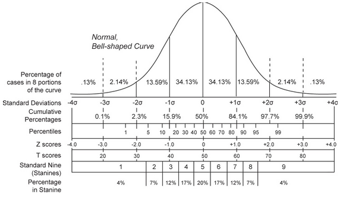
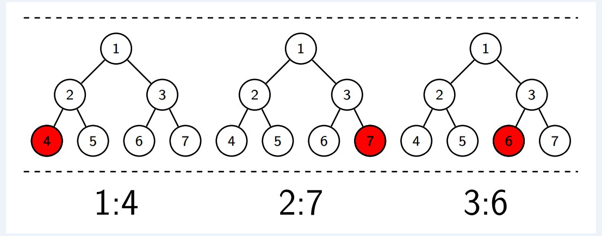
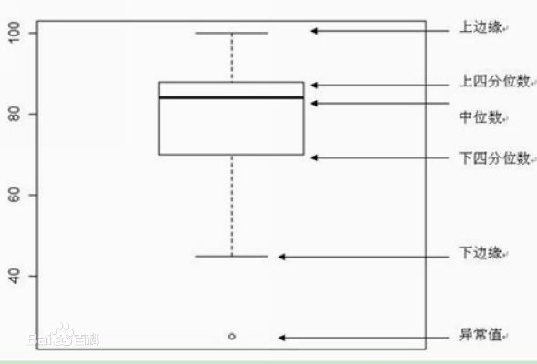

[TOC]

# 精通特征工程一书思维导图


# reference
============

https://help.aliyun.com/document_detail/42703.html?spm=a2c4g.11186623.6.561.A4BRDI (阿里云数据预处理)

https://github.com/luoda888/tianchi-diabetes-top12 (天池精准医疗大赛数据预处理)

https://spark.apache.org/docs/2.3.0/ml-guide.html (spark 机器学习)

# 特征处理

> 稀疏特征无需连续id化


# 常用特征处理方法

## pac

## 特征尺度变化

> 尺度变化函数 log2, log10, ln, abs, sqrt

## 特征离散

## 特征异常平滑

> 将输入特征中含有异常的数据平滑到一定区间



### Zscore 平滑
```bash
    如果特征分布遵循正态分布，考虑噪音一般集在-3xalpha 和 3xalpha 之外，ZScore是将该范围数据平滑到
    [-3xalpha,3xalpha]。

    eg: 某个特征遵循正态分布，均值为0，标准差为3，因此-10的特征值会被识别为异常而修正为-3x3+0=-9，
    同理,10会被修正为3x3+0
```


### 百分位平滑
```bash
    将数据分布在[minPer, maxPer]分位之外的数据平滑平滑到minPer/maxPer这两个分位点
    eg: age特征取值0-200，设置minPer为0，maxPer为50%，那么在0-100之外的特征取值都会被修正成0或者100
```  

### 阈值平滑
```bash
将数据分布在[minThresh, maxThresh]之外的数据平滑到minThresh和maxThresh这两个数据点.
eg: age特征取值0-200，设置minThresh=10，maxThresh=80，那么在0-80之外的特征取值都会被修正成0或者80
```

## 随机森林特征重要性

> 使用原始数据和随机森林模型，计算模型特征重要性

## GBDT 特征重要性

> 计算梯度渐进决策树(GBDT)特征重要性

## 线性模型特征重要性

> 计算线性模型的特征重要性

## 偏好计算

## 窗口变量统计

> 给定时间窗口，计算相应用户在相应时间窗内的行为次数和金额。如时间窗口为’1,7,30,90,180’，
则计算用户相应天数内的行为次数和金额。

## 特征编码

> 由决策树和Ensemble算法挖掘新特征的一种策略. 特征来自一个或多个特征组成的决策树分支，比如下图左边树的分支 节点1->节点2->节点4 形成一个特征. 
很明显，该编码策略可以有效的将 非线性特征 转换为 线性特征.



## one-hot编码

## 异常值检测

> 箱线图



https://zhuanlan.zhihu.com/p/33473642


# reference

[面向机器学习的特征工程-中文版在线阅读](https://github.com/apachecn/fe4ml-zh)

[精通特征工程思维导图](https://github.com/cjn-chen/machine_learn_reading_notes/blob/master/Feature_Engineering_for_Machine_Learning/Feature_Engineering_for_Machine_Learning.jpeg)
