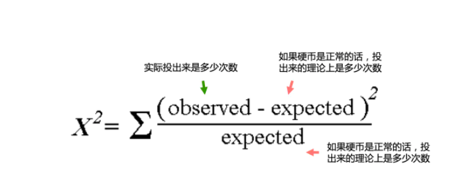
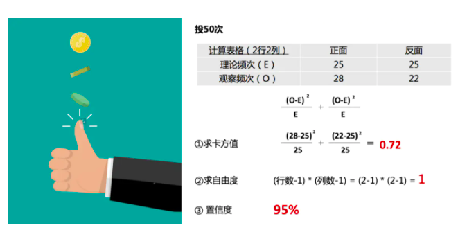
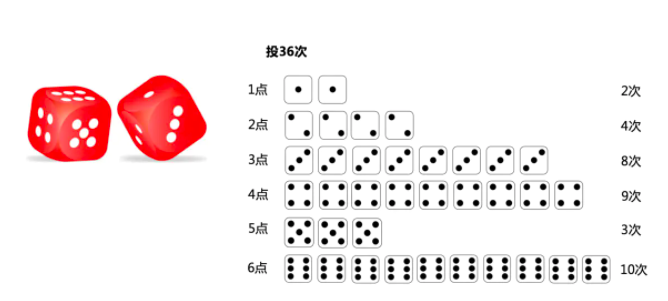
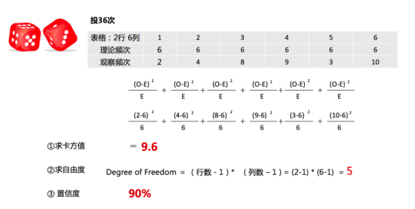
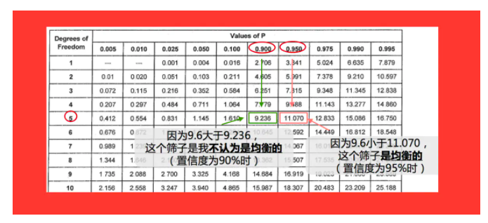
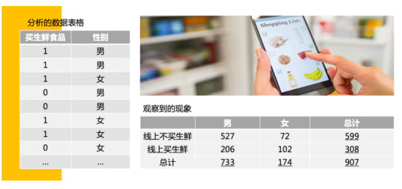
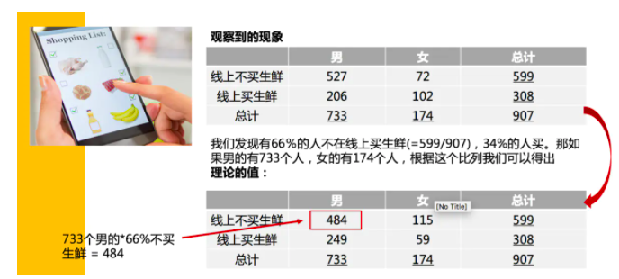
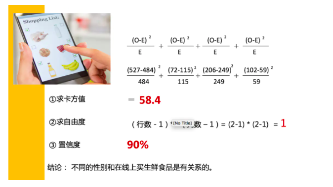
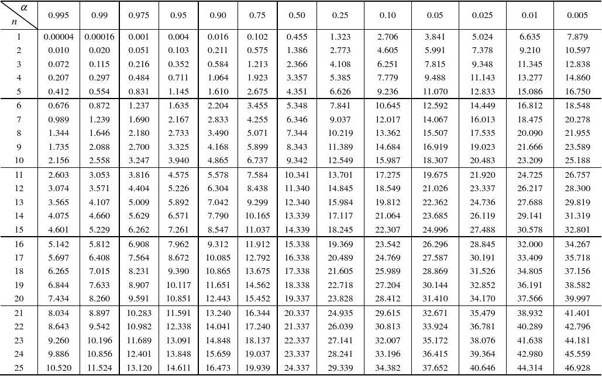
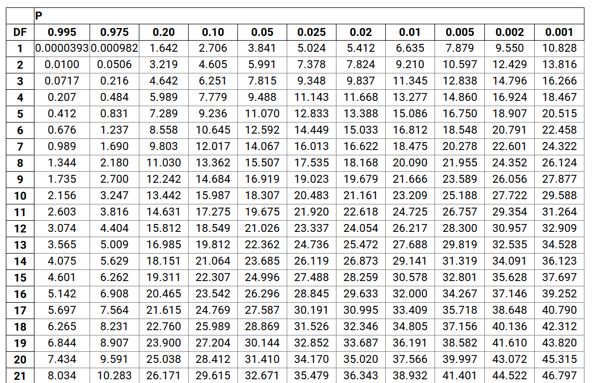

[TOC]

# 卡方检验

卡方检验是统计 样本的实际观测值和理论推断值之间的偏离程度，实际观测值和理论推断值之间的偏离程度决定了卡方值的大小。如果卡方值越大，二者偏离程度越大; 反之，二者偏差越小; 如果两个值完全相等，卡方值就为0，表明理论值完全符合。

卡方检验的理论假设是：一个样本中已发生事件的次数分配会遵守某个特定的理论分配。通常的讲：观测频数跟实际频数应该没有区别，除非两个变量不是独立的。举个例子：XX公司不同部门职员的性别跟部门两者是独立的么？很明显不是哦。这儿我们的期望男女比例是1.05:1，但是在IT研发部分，比例可能是3:1，在HR、客服等部门，比率可能是1:3了。因此这儿的观测值就跟实际值不一致，我们就可以说两个不是独立的。

依据研究者设定的置信水准，查出自由度为 df 的卡方分配临界值，比较它与χ2统计值，推论能否拒绝虚无假设。如果计算出来的统计值大于表的值，则可以拒绝两个独立的假设，也就是说两者相关的，越相关χ2值越大。

从这儿可以看出， χ2比线性相关系数作用会广一些，因为它没有线性的前提假设。但是卡方检验时需要查卡方临界表，但是比较相关性大小就可以不用了。

## 劣势和特点

- 只能应用类别特征

> 通常用卡方检验来检测两个变量或者样本的独立性。卡方检验只能对类别特征进行检验，对于连续型的特征，需要对其分段，离散化再计算卡方分布。

- 不能应用负值

- 没有线性的前提假设，但卡法检验需要查询卡方临界表，但是比较相关性大小就不用了

## 实例

卡方检验是检验两个变量之间有没有关系。例如

> 卡方检验可以检验男性或者女性对线上买生鲜食品有没有区别;
>
> 不同城市级别的消费者对买SUV车有没有什么区别;

如果有显著区别的话，我们会考虑把这些变量放到模型或者分析里去。

### 投硬币

根据投硬币观察到的正面，反面次数，判断这个硬币是均衡的还是不均衡。现在有一个正常的硬币，我给你投50次，你觉得会出现几个正面，几个反面？

按照你的经验你会这么思考，最好的情况肯定是25个正面，25个反面，但是肯定不可能这么正正好好的，嗯，差不多28个正面，22个反面吧；23个正面，27个反面也可能的，但是10个正面，40个反面肯定不可能的，除非我运气真的那么碰巧。

你上面的这个思维方式，就是拿已经知道的结果(硬币是均衡的，没有人做过手脚)，推测出会出现的不同现象的次数。

而卡方检验是拿观察到的现象(投正面或反面的次数或者频数)，来判断这个结果(硬币是不是均衡的)。

继续上面这个例子，如果我不知道这个硬币是不是均衡的，我想用正面，反面的频次来判断，我投了50次，其中28个正面，22个反面。我怎么用卡方检验来证明这个硬币是均衡的还是不均衡的呢？

卡方检验的公式:

卡方值、自由度、置信度三个值的计算方法:

拿到这3个信息，去查表，因为0.72小于查表得到的3.841，所以我们得出这个硬币是均衡的结论。

### 投色子

有一个筛子，我不知道它是不是均衡的，于是我打算投36次看一下。

按照投硬币的方式，我先要画出一个表格，然后计算出3个数值:

带着这3个值，我们去查表，于是我们得出这个现象不能判定他是个均衡的筛子:

### 电商中消费者的性别和购买生鲜

我们要观察性别和在线上买不买生鲜食品有没有关系，现实生活中，女性通常去菜市场买菜的比较多，那么在线上是不是也这样。

我们得出观察到数据，并且形成表格后，我们需要计算理论的数据，在上面的例子我们发现，我们发现有66%的人不在线上买生鲜（599除以907），34%的人会在线上买。 那如果，男的有733个人，女的有174个人，根据这些比例，我们可以得出的理论值是什么呢？

# P 值

## 概念

假设检验中的额P值(probability value)是由检验统计量的样本观察值得出来的原假设可被拒绝的最小显著性水平。

根据P值的定义，对于任意指定的显著性水平 $\alpha$有:

> 若 $p <= \alpha$， 则在显著性水平 $\alpha$下拒绝 $H_0$
>
> 若 $p > \alpha$，则在显著性水平 $\alpha$下接受 $H_0$

## p-value

在讲p-value之前，我们用掷硬币来举个例子。

硬币有正反两面，在概率中我们知道，出现正反面的概率各为50%（1/2），所以作为一个正常的硬币，如果我们投无限次后，结果一定会是正反各占50%。但是，如果我想知道自己手中的硬币，到底是不是正常的硬币，有没有做过手脚，在实际操作中是没办法投掷无限次的。因此，我们只能用有限的结果来判断“硬币是否为常规硬币”这个问题的答案。

在统计学上，做这个检验时，通常会设定一个虚无假设（也叫零假设，Null Hypothesis），通常记作H0。以及一个对立假设（Alternative Hypothesis），及与虚无假设对立的假设，如果证明虚无假设错误，则可以推出对立假设成立。

在掷硬币这个例子中，我们可以设定

H0: 手中的硬币是常规硬币

H1: 手中的硬币做过手脚

如果手中硬币是常规硬币，我们知道正面和反面出现的概率各为50%，所以如果我投掷10次硬币，则正面和反面出现的次数各位5次。正面5次，反面5次，就是我们对于投掷10次硬币的期望值（expected value）。

现在我们开始投掷硬币，出现的是正面3次，反面7次。这个结果就是我们对于投掷10次硬币的观测值（observed valued），即实际的结果。

通过分析期望值和观测值的差距，我们就可以判断出硬币是否正常。而这个期望值和观测值差距的判断方法就是chi-square。

$\chi^2 = \sum_{i=1}^n \frac {(O_i - E_i)^2} {E_i}$

O代表观测值（observed value），E代表期望值（expected value）。有没有觉得这和方差的公式很像？没错，其实方差是一组数据与其均值的比较，而chi-suaqre是一组数据与另一组数据期望值的比较。

那么在掷硬币这个例子中chi-square（卡方）=(3-5)^2/5+(7-5)^2/5=1.6。

算出了chi-square，那么又怎判断检验结果呢？如上图卡方分布表。

左上角 $\alpha$ 表示错误拒绝H0假设的概率(即零假设本身成立，但计算出的结果却是错误判断虚无假设不成立的概率)。n代表自由度（degree of freedom），即独立变量数减1，在这个例子中，独立变量数为2（正面和反面），所以自由度为1（2-1=1）。

当然，你也会见到与上图不一样的卡方分布图，比如下图。P代表α，即P(当H0为真时拒绝H0)（其实就是p-value），df代表自由度（degree of freedom）。

假设置信度为95%，即错误拒绝H0的概率为0.05。展开解释就是，我们有95%的概率确信检验结果正确，有5%的概率会错误拒绝虚无假设。（我们总说的p值与0.05比较就是这个啦，其实不一定时0.05，根据具体情况可以设置不一样的值，只是大部分时候都用0.05。

对照着卡方分布表，找到1所在的行（我们计算出的chi-square自由度是1），发现1.6是介于1.323和2.706之间，查表得出其p值为0.25到0.1之间，大于0.05，所以我们不能拒绝H0。换句话说，H0成立，即硬币是常规硬币，没有做手脚。

大家通过观察卡方分布表能够发现，在用一个自由度下，chi-square越大，其p值就越小。举个极端的例子，如果在掷硬币的例子中，我投掷10次硬币，刚好5次正面，5次反面，则此时算是的chi-square为0（观测值与期望值一致），这时的p-value是远大于0.995，没有理由拒绝H0,H0假设成立，即硬币是常规硬币。

因此

1. p-value作用: 是用来判断H0假设是否成立的依据。因为期望值是根据H0假设提出的，如果观测值与期望值一致，则说明假设检验与零假设越接近，则越没有理由拒绝H0假设; 如果观测值与期望值越偏离，说明零假设越站不住脚，则越有理由拒绝零假设，从而推出对立假设的成立。

2. 做出H0,H1这对互斥的假设，计算出H0为真时的期望值，统计出实际的观测值，通过期望值和观测值求得chi-square（卡方），再通过卡方查表，得到p值。根据p值与α（1-置信度）的比较，如果p-value<α，则拒绝（reject）H0，推出H1成立；如果p-value>α，则接受（accpet）H0，推出H1不成立。

3. 【为什么小于0.05就很重要？】大部分时候，我们假设错误拒绝H0的概率为0.05，所以如果p值小于0.05，说明错误拒绝H0的概率很低，则我们有理由相信H0本身就是错误的，而非检验错误导致。大部分时候p-value用于检验独立变量与输入变量的关系，H0假设通常为假设两者没有关系，所以若p值小于0.05，则可以推翻H0（两者没有关系），推出H1（两者有关系）。

4. 【很重要是什么意思？】当p值小于0.05时，我们就说这个独立变量重要（significant），因为这个独立变量与输出结果有关系。

# reference

[结合日常生活的例子，了解什么是卡方检验](https://www.jianshu.com/p/807b2c2bfd9b)

[浅谈p值（p-value是什么）](https://www.cnblogs.com/lijingblog/p/11043513.html)
