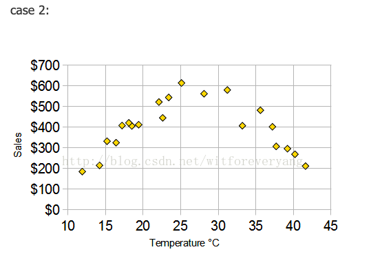

[TOC]

# 概念

线性相关系数，即Pearson相关系数，主要衡量的两个变量的相关的程度。在线性拟合的时候，通常看相关系数来评估拟合程度。

计算公式为:

$r = \frac {\sum_i^n (x_i - \overline x) * (y_i - \overline y)} {\sqrt{\sum_i^n (x_i - \overline x)^2 * (y_i - \overline y)^2}}$

r 的取值为[-1,1].

# 注意事项

## 两个变量线性相关是基础

线性相关系数是衡量两个变量线性相关程度的指标，但必须建立在自变量和因变量是线性的关系基础上，这样相关系数才能告诉你他两个相关程度如何。

从公式可以看出，只有一个数据，分母为0，线性相关系数也毫无意义。另外，即使是少量数据计算相关系数也毫无意义。

否则线性相关系数是没有意义的。例如：非线性相关也会导致相关系数较大；离群点也会导致相关系数较大。

例如，你先算出相关系数=0.9，就下结论说两个变量线性相关是不对的，甚至说两个变量相关（有某种更复杂的关系）也是不对的。

> 如图（右上）所示，非线性相关也会导致线性相关系数很大；
>
> 如果两个变量的相关系数很大(0.816)，那能不能说两者相关呢？ 答案还是不能，为什么？ 因为如图（右下）所示，很可能是一个离群点（outlier）导致了相关系数变得很大。
>

## 相关系数=0, 只能说明两个变量不是线性相关

如上图， 相关系数=0, 只能说明两个变量不是线性相关，但不能完全说不相关。

## 确定关系一定要进行可视化

# reference

[关于相关系数的一些理解误区](https://blog.csdn.net/witforeveryang/article/details/42585791)

