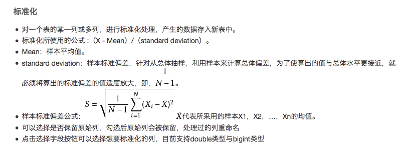

# 数据预处理

## 加权采样

> 以加权方式生成采样数据

## 随机采样

> 以随机的方式采样，每次采样都是独立的

## 分层采样

> 数据集分层抽取一定比例或者一定数据的随机样本

## 过滤与映射

## 归一化

```bash
对一个表的某一列或多列，进行归一化处理，产生的数据存入新表中。
目前支持的是线性函数转换，表达式如下：y=(x-MinValue)/(MaxValue-MinValue)，MaxValue、
MinValue分别为样本的最大值和最小值。
```

## 标准化



