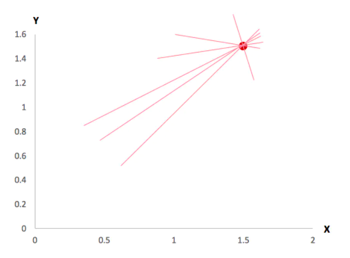
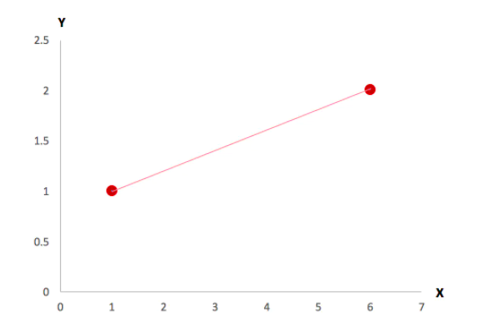
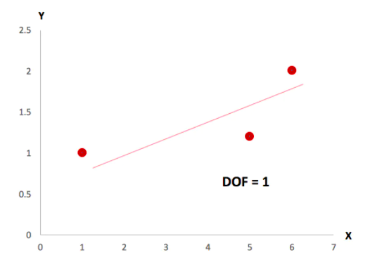
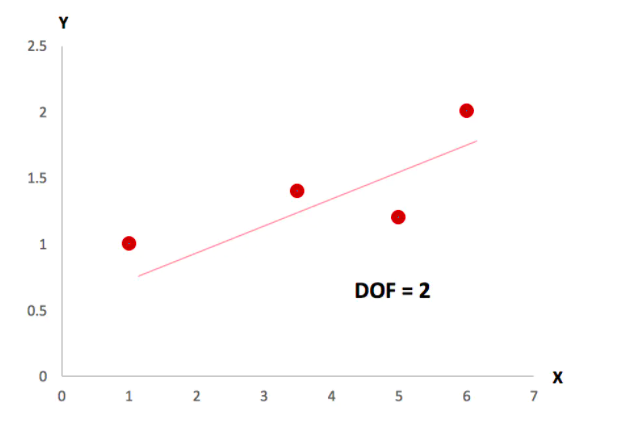
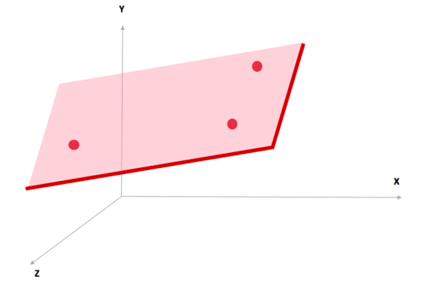
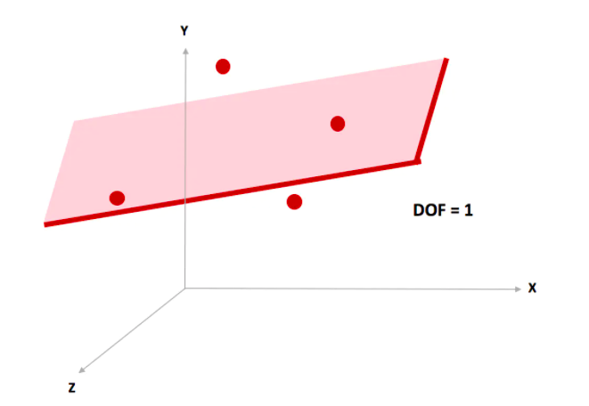

[TOC]

# 概念

自由度(degree of freedom, df)是指计算某一个统计量时，取值不受限制的变量个数。

# 实例

## 日常生活的df

首先，你先不要想统计的知识，我们讲一个平时生活里的例子，比如你是一个非常喜欢鞋子的人，你每个礼拜每一天都想穿上不一样的鞋子，比如周一穿高跟鞋，周二穿运动鞋，等等。

但是你只有7双鞋，所以，在礼拜一的时候，你可以在7双鞋子里随便挑一双穿，到了礼拜二，你可以在剩下的6双里面挑一双穿，到了礼拜六，只剩下2双给你挑了，过完礼拜六，只剩下一双鞋了，你只能穿这双，因为你没有其他的鞋子可以挑了。所以，这7双鞋子里面，你能够自由挑选的是 7-1 ＝ 6双。

## T test 的degree of freedom

回到统计中的自由度。有一组数需要填入10个数字，假设没有任何约束，你可以填写任何的数。但是如果我告诉你，你填的这些数的平均值必须是6.5。那这10个数，你会怎么填呢？

前9个数，你可以随机填写：

举例一： 40, -2.3, -31, -86, 5, 6, 7, -16, 105

举例二： 0.4, 0.5, 0.6, 0.7, 0.8, 0.9, 1, 1.1, 1.2

但到了第十个数，你就不能随机填写了，由于这10个数的平均数是6.5，所以第十个数必须是：

举例一： 40, -2.3, -31, -86, 5, 6, 7, -16, 105 -> 第十个数必须是 37.3

举例二： 0.4, 0.5, 0.6, 0.7, 0.8, 0.9, 1, 1.1, 1.2 -> 第十个数必须是 57.8

你有没有注意到，这10个数的，你能够随机填写的是10-1=9个数。一旦确定有平均数存在，无论是几个数，你能够自由填写的都是n-1。我们说有n-1的自由度，n是样本量。

## Chi-Square Test 的degree of freedom

我们看一下另一个情景，卡方检验是用来检验分类变量是否是独立的一种检验方式。在这个检验中，自由度是指在contingency 表可以自由填写的数，同时这个contingency表也有自己的约束，即每行每列的加总是定值。每个空格内的数，是这个现象观察到的次数。

下面是一个2*2的contingency table：

|         | 吸烟     | 不吸烟   | total |
| :----:  | :----:  | :----:  | :----:|
|   男    |    ？   |         |   170 |
|   女    |         |         |    80 |
|  total  |   150   |   100   |       |

你有没有发现，当你填了一个数后，剩下的3个数，就已经事先由每行或每列加总的数决定好了。比如我在男吸烟那里天了120，那么利用Total的值我们可以得出：男不吸烟显然是 170 - 120 ＝ 50， 女吸烟是 150 - 120 ＝ 30， 女不吸烟是 100 - 50 = 50

同样，我们再看一下2*3的contingency table:

|         | 爱打牌  | 爱打游戏  |   爱打麻将|  total |
| :----:  | :----:  | :----:  | :----:  | :----: |
|   男    |     ？  |    ？    |         |   170  |
|   女    |         |         |         |    130  |
|  total  |   150   |   100   |    50   |    50  |

这个例子中，只要填了2个值，剩下的4个数的数值也可以同时计算出来。
总结以上的例子，如果我们有r行，c列的表格，我们可以自由填写的有(r－1)(c－1)个数，这就是卡方检验的自由度计算公式。

## Regression 的degree of freedom

回到开头说的回归分析里的自由度计算，我们先来看一下回归公式：

$y = ax + b$

现在有个问题：至少需要几个观察点，可以得出这个公式？首先，如果給一个观察点的话，这条直线画的出吗？显然是不可能的(如下图)。

那如果有两个观察点呢？如下图，如果有两个观察点的话，能确切地画出一条直线。

只要给2个等式就能求解两元一次公式：比如 y= kx+b 已知点(1,3) (2,5)。我们能够求出斜率k，和截距b。

在这个公式中，你没有任意的自由度去自己挑选k和b是多少，给定的2点已经确认了k和b的值，我们做的只是去求一个唯一解。所以这时候 degree of freedom 是 0。

那什么时候degree of freedom 不为0呢？当给了3个点，由于我们理论上只需要任意2个点就可以确定这个公式解，所以这里的degree of freedom 是 3 - 2 = 1。

同样，当给了4个点，degree of freedom 4 - 2 = 2。

如下图，在三元方程  $y = ax_1 + bx_2 + c$，我们只需要3个点就能确定一个平面，但如果是四个点的话，degree of freedom ＝ 4 - 3 = 1; 如果是5个点的话， degree of freedom ＝ 5 - 3 = 2。

如果我们把公式中X的数量看作是我们回归中的feature个数k，那么如果有n个观察点，则degree of freedom等于n - k - 1。

# reference

[用可视化思维解读统计自由度](https://www.jianshu.com/p/0032087b9dbb)
