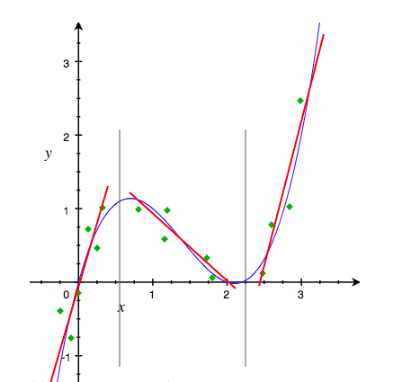

[TOC]

# 特征使用方案

- 确定实现我们的目标需要哪些数据

> 基于业务理解，尽可能多的找到对因变量有影响的自变量

- 可用性评估

> 获取难度
>
> 准备率
>
> 覆盖率

# 特征获取方案

- 如何获取这些特征

- 如何存储这些特征

# 特征工程

## 特征清洗

- 异常值分析过滤

异常值分析过滤是分析检验数据中是否有错误数据或者不合理的数据。如果有，则将这些数据剔除。常见的异常值分析方法有:

1. 简单统计量分析方法

可以对变量做一个描述性的统计与分析，然后查看数据是否合理。例如比较常用的统计量包括最大值与最小值，如果变量超过了最大值最小值的范围，那这个值就为异常值。例如年龄属性，如果某人填写为200或者-1，这显然都是属于异常值的范畴。

2. $3 \sigma$ 原则

如果数据的分布服从高斯分布(正态分布)，3原则是指，测量值如果与平均值的偏差超过 $3\sigma$，即为异常值。

理论依据如下：

当 $X ∼ N ( 0 , 1 ) \quad p \{ − 1 ≤ X ≤ 1 \} = 0.683$

$p \{ − 2 ≤ X ≤ 2 \} = 0.954$

$p \{ − 3 ≤ X ≤ 3 \} = 0.997$

那么如果随机变量X 服从正态分布，从 $u - 3\sigma$到 $μ + 3\sigma$ 的区间内，概率密度曲线下的面积占总面积的99.7%。

- 采样-数据不均衡

> 加权采样
>
> 随机采样
>
> 分层采样

## 特征预处理

### 数据平滑

因为现在机器学习的主流是统计机器学习，既然是统计，自然就离不开概率的计算。例如在对文本进行分类时，语料库毕竟是有限的。假设w 没在语料库中出现过，那根据最大似然估计MLE，这些词出现的概率为0。但是实际上这些词出现的概率肯定是不为0的。像最大似然估计里涉及到很多概率的连乘计算，如果一个概率为0，就会导致整体计算结果为0。这时候，就需要我们对数据进行平滑了。

平滑的算法有很多。最简单的平滑方式属于加1平滑了，就是给每种情况出现的次数都加上1，这样就避免了概率为0的情况。这种方式简单粗暴，实际使用的效果一般也不会特别理想。当然还有Good-turning平滑，线性插值平滑（Linear Interpolation Smoothing）等其他算法，根据具体的业务场景进行选择

### 单个特征

#### 无量纲化

- 解决特征的规格不一样，不能放在一起比较。常用的方法主要有标准化和区间缩放法。标准化的前提是特征服从正态分布，标准化后，转换为标准正态分布。区间缩放法利用了边界值信息，将特征的取值区间缩放到某个特定范围，比如[0,1]等。

- 标准化和归一化的区别

> 标准化是依据特征矩阵的列处理数据，通过求z-score的方法，将样本的特征值转换到同一量纲下
>
> 归一化是依照特征矩阵的行处理数据，其目的在于样本向量在点乘运算或其他核函数计算相似性时，拥有统一的标准，也就是说都转化为“单位向量”。规则为l2的归一化公式如下：$x' = \frac {x} {\sqrt{\sum_j^m x_j^2}}$

##### 标准化

$$x' = \frac {x - \overline{X}} {S}$$

##### 区间缩放法

$$x' = \frac {x - Min} {Max - Min}$$

#### 离散化

- 主要解决定量特征，包含的有效信息区间进行划分。例如，学习成绩只关注”及格“和”不及格“，二值化可解决类似问题。

- 等距离离散：顾名思义，就是离散点选取等距点

- 等样本点离散：选取的离散点保证落在每段里的样本点数量大致相同

- 画图观察趋势：以x为横坐标，y为纵坐标，画图，看曲线的趋势和拐点。通过观察下面的图我们发现可以利用3条直线（红色直线）来逐段近似原来的曲线。把离散点设为两条直线相交的各个点，我们就可以把xx离散化为长度为3的向量

- 决策树模型

决策树离散化方法通常也是每次离散化一个连续特征，做法如下：

单独用此特征和目标值y训练一个决策树模型，然后把训练获得的模型内的特征分割点作为离散化的离散点。这种方法当然也可以同时离散化多个连续特征，但是操作起来就更复杂了，实际用的不多。

- 核方法

- 笛卡尔乘积

我们可以使用笛卡尔乘积的方式来组合2个或更多个特征。比如有两个类别特征color和light，它们分别可以取值为red，green，blue和on, off。这两个特征各自可以离散化为3维和2维的向量。对它们做笛卡尔乘积转化，就可以组合出长度为6的特征，它们分别对应着原始值对(red, on)，(red, off)，(green, on)，(green, off)，(blue, on)，(blue, off)。下面的矩阵表达方式更清楚地说明了这种组合。

| X       | on      | off     |
| :----:  | :----:  | :----:  |
|   red   |         |         |
|   green |         |         |
|   blue  |         |         |

对于3个特征的笛卡尔乘积组合，可以表达为立方的形式。更多特征的组合依次类推。 这个方法也可以直接用于连续特征与类别特征之间的组合，只要把连续特征看成是1维的类别特征就好了，这时候组合后特征对应的值就不是0/1了，而是连续特征的取值。

#### Dummy Coding

- 主要解决定性特征，通常用亚编码的方式将定性特征转换为定量特征。对于线性模型来说，使用亚编码的特征可以达到非线性的效果。

- 无序特征

比如一个无序特征color有三种取值：red，green，blue。那么可以用一个长度为3的向量来表示它，向量中的各个值分别对应于red，green，blue。

| color取值| 向量表示 |
| :----:  | :----:  |
|   red   | (1,0,0) |
|   green | (0,1,0) |
|   blue  | (0,0,1) |

- 有序特征

有些特征虽然也像无序特征那样只取限定的几个值，但是这些值之间有顺序的含义。例如一个人的状态status有三种取值：bad, normal, good，显然bad < normal < good

| status取值| 向量表示 |
| :----:  | :----:  |
|   bad   | (1,0,0) |
|   normal| (1,1,0) |
|   good  | (1,1,1) |

#### 缺失值

- 丢弃

> 最简单的方式，如果发现数据有缺失，直接删除这个字段或者将整个样本丢弃。如果某个特征特别重要，重新采集数据。

- 统计值填充

> 平均值、中值、分位数、众数、随机值等。这种方式难度也不大，效果一般。最大的副作用就是人为带来了不少噪声

- 预测填充

> 用其他变量做预测模型来预测缺失值，效果一般比统计值填充要好一些。但是此方法有一个根本缺陷，如果其他变量和缺失变量无关，则预测的结果无意义。如果预测结果相当准确，则又说明这个变量是没必要加入建模的。一般情况下，介于两者之间。

- 将变量映射到高维空间

> 比如性别，有男、女、缺失三种情况，则映射成3个变量：是否男、是否女、是否缺失。连续型变量也可以这样处理。比如Google、百度的CTR预估模型，预处理时会把所有变量都这样处理，达到几亿维。这样做的好处是完整保留了原始数据的全部信息、不用考虑缺失值、不用考虑线性不可分之类的问题。缺点是计算量大大提升。而且只有在样本量非常大的时候效果才好，否则会因为过于稀疏，效果很差。

#### 数据变化

- log

- 指数

- Box-Cox

### 多个特征

#### 特征选择

- 特征是否发散

> 如果一个特征不发散，例如方差接近于0，也就是说样本在这个特征上基本上没有差异，这个特征对于样本的区分并没有什么用。
>

- 特征与目标的相关性

> 这点比较显见，与目标相关性高的特征，应当优选选择。除方差法外，本文介绍的其他方法均从相关性考虑。

##### Filter

- 思路: 通过自变量和目标变量之间的关联

###### 方差选择法

> 使用方差选择法，先要计算各个特征的方差，然后根据阈值，选择方差大于阈值的特征。

###### 相关系数

> 使用相关系数法，先要计算各个特征对目标值的相关系数以及相关系数的P值。
>
>工程上常用的手段有计算皮尔逊系数和互信息系数，皮尔逊系数只能衡量线性相关性而互信息系数能够很好地度量各种相关性，但是计算相对复杂一些。

###### 卡方检验

- 经典的卡方检验是检验定性自变量对定性因变量的相关性。

> 假设自变量有N种取值，因变量有M种取值，考虑自变量等于i且因变量等于j的样本频数的观察值与期望的差距，构建统计量 $\chi^2 = \frac {(A-E)^2} {E}$

###### 信息增益、互信息

- 经典的互信息也是评价定性自变量对定性因变量的相关性的

> 互信息计算公式如下: $I(X;Y) = \sum_{x \in X} \sum_{y \in Y} p(x,y) log \frac{p(x,y)} {p(x) p(y)}$

##### Wrapper

- 思路: 通过目标函数(AUC/MSE) 来决定是否加入一个变量, 每次选择若干特征，或者排除若干特征。

- 迭代: 产生特征子集，评价

> 完全搜索
>
> 启发式搜索
>
> 随机搜索: GA + SA

##### Embedded

- 思路: 学习器自身自动选择特征, 先使用某些机器学习的算法和模型进行训练，得到各个特征的权值系数，根据系数从大到小选择特征。类似于Filter方法，但是是通过训练来确定特征的优劣。

###### 正则化

- L1-lasso

- L2-Ridge

###### 决策树-熵、信息增益

###### 深度学习

#### 特征组合

- GBDT

- FM

#### 降维

当特征选择完成后，可以直接训练模型了，但是可能由于特征矩阵过大，导致计算量大，训练时间长的问题，因此降低特征矩阵维度也是必不可少的。

常见的降维方法除了以上提到的基于L1惩罚项的模型以外，另外还有主成分分析法（PCA）和线性判别分析（LDA），线性判别分析本身也是一个分类模型。

PCA和LDA有很多的相似点，其本质是要将原始的样本映射到维度更低的样本空间中，但是PCA和LDA的映射目标不一样：PCA是为了让映射后的样本具有最大的发散性；而LDA是为了让映射后的样本有最好的分类性能。所以说PCA是一种无监督的降维方法，而LDA是一种有监督的降维方法。

##### PCA(Principal Component Analysis) 主成分分析

##### SVD(Singular Value Decomposition) 奇异值分解

##### LDA(Linear Discriminant Analysis) 线性判别分析

## 衍生变量

- 对原始数据加工，生成有商业意义的变量

# reference

[特征工程到底是什么？](https://www.zhihu.com/question/29316149/answer/110159647)

[coursera视频课程-高级机器学习 专项课程](https://www.coursera.org/specializations/aml?siteID=lVarvwc5BD0-AqkGMb7JzoCMW0Np1uLfCA&utm_campaign=lVarvwc5BD0&utm_content=2&utm_medium=partners&utm_source=linkshare)

[课程-Feature selection](https://people.eecs.berkeley.edu/~jordan/courses/294-fall09/lectures/feature/)

[课程-Knowledge Discovery and Data Mining 1](https://courses.isds.tugraz.at/dhelic/kddm1/index.html)

[课程-油管上CMU授课的特征工程](www.youtube.com/watch%3Fv%3DdrUToKxEAUA)

[课程-FES.columbia](http://www.columbia.edu/~rsb2162/FES2013/materials.html)

[Slides-Feature Engineering (PDF), Knowledge Discover and Data Mining 1, by Roman KernFeature](http://kti.tugraz.at/staff/denis/courses/kddm1/featureengineering.pdf)

[Slides-Engineering and Selection](http://www.cs.berkeley.edu/~jordan/courses/294-fall09/lectures/feature/slides.pdf)

[Slides-Feature Engineering](http://www.cs.princeton.edu/courses/archive/spring10/cos424/slides/18-feat.pdf)

[Slides-KDD CUP 2010年冠军的论文](http://pslcdatashop.org/KDDCup/workshop/papers/kdd2010ntu.pdf)

[book-Amazon.com: Feature Extraction, Construction and Selection: A Data Mining Perspective (The Springer International Series in Engineering and Computer Science) (9780792381969): Huan Liu, Hiroshi Motoda: Books](http://www.amazon.com/dp/0792381963?tag=inspiredalgor-20)

[book-Feature Extraction: Foundations and Applications (Studies in Fuzziness and Soft Computing): Isabelle Guyon, Steve Gunn, Masoud Nikravesh, Lofti A. Zadeh: 9783540354871: Amazon.com: Books](http://www.amazon.com/dp/3540354875?tag=inspiredalgor-20)

[book-Mark Nixon: 9780123965493: Amazon.com: Books](http://www.amazon.com/dp/0123965497?tag=inspiredalgor-20)

[book-Huan Liu, Hiroshi Motoda: 9780792381983: Amazon.com: Books](http://www.amazon.com/dp/079238198X?tag=inspiredalgor-20)

[book-Amazon.com: Computational Methods of Feature Selection (Chapman & Hall/CRC Data Mining and Knowledge Discovery Series) (9781584888789): Huan Liu, Hiroshi Motoda: Books](http://www.amazon.com/dp/1584888784?tag=inspiredalgor-20)

[用户特征工程 超详细解读](https://blog.csdn.net/bitcarmanlee/article/details/52244237)

[机器学习_特征处理](https://blog.csdn.net/kanbuqinghuanyizhang/article/details/78993386)

[特征处理(Feature Processing)](http://breezedeus.github.io/2014/11/15/breezedeus-feature-processing.html)
