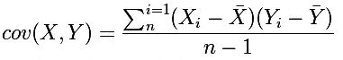

# 统计分析方法

## 百分位

> min, max, media, lower Quartitle(Q1), Quartitle(Q2)

> total, missingcount, nancount, variance, standarddeviation, standarderror

```bash
describe: count, unique, top, freq

value_counts: uniqe count
```

## Pearson Correlation Coefficient (皮尔逊相关系数) 和协方差

> 协方差用于描述两个变量之间线性关系的密切程度，其值大小与两个变量的量纲有关系，不适合比较

> Pearson相关系数，相当于协方差的"标准化"，消除了量纲的影响
> 相关系数 > 0: 当一个变量增大，另一个变量也增大，表明他们正相关
> 相关系数 < 0: 当一个变量增大，另一个变量却减小，表明他们负相关
> 相关系数 = 0: 它们之间不存在线性关系

> 如果两个变量相互独立，则它们的相关系数为0; 如果两个随机变量的相关系数为0，这两个随机变量未必独立

```bash
其实皮尔逊系数就是cos计算之前两个向量都先进行中心化(centered)...就这么简单...中心化的意思是说, 对每个向量, 我先计算所有元素的平均值avg, 
然后向量中每个维度的值都减去这个avg, 得到的这个向量叫做被中心化的向量. 机器学习, 数据挖掘要计算向量余弦相似度的时候, 由于向量经常在某个维度上有数
据的缺失, 预处理阶段都要对所有维度的数值进行中心化处理.我们观察皮尔逊系数的公式:分子部分: 每个向量的每个数字要先减掉向量各个数字的平均值, 这就是在
中心化.分母部分: 两个根号式子就是在做取模运算, 里面的所有的 r 也要减掉平均值, 其实也就是在做中心化.
```


> 在数据标准化（ u=0, sigma=1 ）后，Pearson相关性系数、Cosine相似度、欧式距离的平方可认为是等价的。

> Pearson 相关系数是升级版的欧式距离平方，因为提供了不同取之范围的处理





https://www.zhihu.com/question/19734616

## 离散值特征分析

> 指标： gini、entropy、gini gain、information gain、information gain ratio

## P值

> 统计结果的真实程度(是否能够代表总体)的一种估计方法。

> p值将结果认为有效(即具有总体代表性)的犯错概率。 如p=0.05提示样本中有5%的可能性是由于偶然性造成的

> P值为结果可信程度的一个递减指标，p值越大，

## T 检验

> 前提：样本总体服从正太分布

> 单样本T检验：检验某个变量的总体均值和某指定值之间是否存在显著差异

## 卡方检验


## 散点图

> 在回归分析中，数据点在直角坐标系平面上的分布图

## 正太检验

## 洛伦兹曲线

