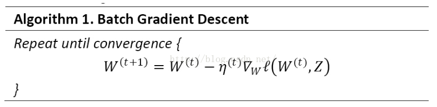
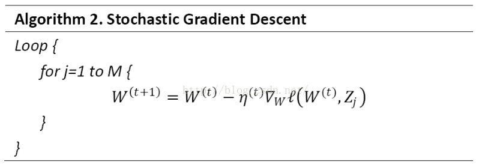
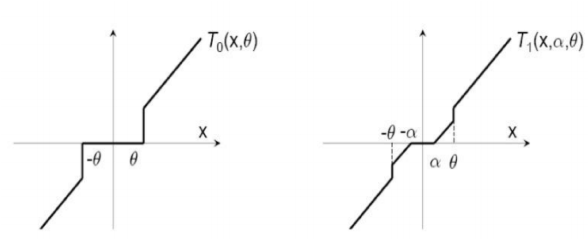
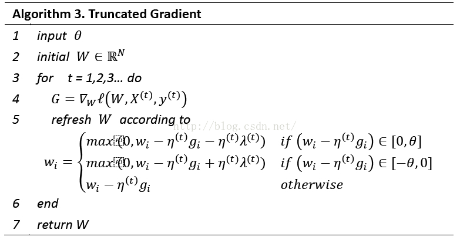

[TOC]

# FTRL的演进过程

## LR

在实际广告点击率预测应用中，样本数目和特征（逻辑回归粗暴离散化后）的数目均可以达到上亿维度，而LR因为其简单、易并行，并在复杂的特征工程后也可以达到好的效果，所以在工业界中获得了广泛的应用。

逻辑回归优点：

（1）简答

（2）易于并行，速度快

逻辑回归缺点：

（1）需要复杂的特征工程

（2）输入特征需要离算化处理

## SGD(Stochastic Gradient Descent)

### 实际工程中GD下降发法遇到的问题

（1）对参数训练每一次迭代过程，都需要遍历所有样本，这在实际应用中迭代速度太慢，模型更新速度也太慢

（2）机器学习中更多的数据意味着更好的效果，所以可以把线上的数据和标注引入进来

### SGD方法

思路：每次取部分训练集作为原训练集的子集，使用这些子集做迭代，并逐步求解W的下降方向，逐步对W进行更新(理论证明未知)。特别地，如果每次取原训练样本的一个训练样本，对w的值逐步进行更新，就得到了SGD算法

### 与GD方法进行比较

（1）GD需要每次扫描所有的样本计算一个全局梯度，SGD则每次只针对一个观测样本进行更新

（2）通常情况SGD可以更快的逼近最优值，而且SGD每次更新只需要一个样本，使得它很适合在进行增量或者在线计算

### 问题

（1）目的： 迭代和选取模型经常希望得到更加稀疏的模型，这不仅仅起到了特征选择的作用，也降低了预测计算的复杂度。

（2）LR： 使用L1或者L2正则，可以避免过拟合和增加模型的鲁棒性

（3）GD：L1正则通常能够得到更加稀疏的解

（4）SGD：不是沿着全局梯度下降，而是沿着某个样本的梯度进行下降，这样L1正则不一定得到稀疏解(原因？)。而在优化算法中，稀疏性是一个主要的追求目标。

## 梯度下降类算法(OGD(Online Gradient Descend)在线最优化求解)

### L1正则化法

由于L1正则项在0处不可导，往往造成平滑的凸优化问题变成非平滑的凸优化问题，因此可以采用次梯度(Subgradient)来计算L1正则项的梯度，权重更新方式为

$W^{t+1}=W^t - \eta^t G^t - \lambda \eta^t sgn(W^t)$

其中，$\lambda >=0$是一个标量，为正则化参数； $\eta^t$ 为学习率，通常设置为 $1 \over \sqrt{t}$， t为迭代次数；$G^t=\nabla_wL(W^t, Z^t))$ 代表第t次迭代中损失函数的梯度。

### 简单截断法

L1正则化在Online模式下也不能产生较好的稀疏性，而稀疏性对于高维特征向量及大数据集又特别重要，我们应该如何处理呢？简单粗暴的方法是设置一个阀值，当W的某纬度的系数小于这个阀值的时候，将其直接设置为0。这样我们就得到了简单截断法。

以k为窗口，当t/k不为整数时，采用标准的SGD进行迭代；当t/k为整数时，采用如下权重更新方式：

设置一个阈值 $\theta$ ，当w的某个维度的系数小于 $\theta$时，将其设置为0，权重更新方式为

$W^{t+1} = T_0(W^t - \eta ^t G^t, \theta)$

$T_0(v_i, \theta) = \begin{cases}  0  & { if |v_i| \leq \theta} \\ v_i & \text{otherwise} \end{cases}$

问题：在实际过程中，w的某个特征系数可能因为该特征训练不足引起的，简答的截断过于粗暴(too aggresive)，会造成该特征的缺失

### TG(Truncated Gradient)

简单梯度截断法过于粗暴，采用梯度极端法可以使权重归零和截断处理更温柔些。简单截断法和梯度截断法对权重特征的处理区别如下图:

$W^{t+1} = T_1(W^t - \eta^t G^t, \eta^t \lambda^t, \theta)$

$T_1(v, \alpha, \theta) = \begin{cases}
max(0, v_i - \alpha) &	{if v_i \in [0, \theta]} \\
min(0, v_i + \alpha) &	{if v_i \in [-\theta, 0]} \\
v_i &	\text{otherwise}
\end{cases}$

其中， $\lambda^t \in R^+$. TG同样以k为窗口，每隔k步进行一次截断。当t/k不为整数时 $\lambda^t=0$； 当t/k为整数时 $\lambda^t=k\lambda$。从公式中可以看出 $\lambda 和 \theta$决定了w的系数程度，两个值越大，稀疏性越大。尤其是当$\lambda=\theta$时，只需要通过调节一个参数就可以控制稀疏性。

TG算法逻辑

### TG与L1正则以及简单截断之间关系

将上述特征权重更新方式进行改写如下

$w_i^{t+1} = \begin{cases}
Trnc((w_i^t - \eta^t g_i^t), \lambda_{TG}^t, \theta)   & if mod(t, k) = 0 \\
w_i^t - \eta^t g_i^t 		& \text{otherwise}
\end{cases}$

$Trnc(w, \lambda_{TG}^t, \theta) = \begin{cases}
0	& 	{ if |w| \leq \lambda_{TG}^t} \\
w - \lambda_{TG}^t sgn(w) 	& {if \lambda_{TG}^t \leq |w| \leq \theta} \\
w  & \text{otherwise}
\end{cases}$

其中 $\lambda_{TG}^t = \eta^t \lambda k$

如果令 $\lambda_{TG}^t = \theta$，截断公式变为

$Trnc(w, \theta, \theta) = \begin{cases}  
0 & {if |w| \leq \theta} \\  
w & \text{otherwise} 
\end{cases}$

此时TG退化为简单截断法。

如果令 $\lambda_{TG}^t = \infty$ ，截断公式变为
$Trnc(w, \lambda_{TG}^t, \infty) = \begin{cases}
0  	& {if |w| \leq \lambda_{TG}^t} \\
w 	& \text{otherwise}
\end{cases}$

如果再令k=1，则
$w_i^{t+1} = Trnc((w_i^t - \eta^t g_i^t), \eta^t \lambda, \infty) = w_i^t - \eta^t g_i^t - \eta^t \lambda sgn(w_i^t)$

此时TG退化为L1正则化。

### FOBOS

#### FOBOS（Forward Backward Splitting）算法原理

在该算法中，权重更新分为两个步骤：

$W^{t+0.5} = W^t - \eta^tG^t$		此步骤实际上是一个标准的梯度下降

$W^{t+1} = arg \min_{w} \{1/2||W - W^{t+0.5}||_2^2 + \eta^{t+0.5} \psi(W) \}$	是对上一个步骤的局部调整

写成一个公式

$W^{t+1} = arg \min_w \{ 1/2 || W- W^t + \eta^tG^t ||_2^2 + \eta^{t+0.5} \psi(W) \}$

假设 $F(W)= 1/2 || W - W^t + \eta^t G^t ||_2^2 + \eta^{t+0.5} \psi(W) $
如果$W^{t+1}$ 存在一个最优解，那么可以推动0向量一定属于F(W)的次梯度集合：

$0 \in \partial F(W) = W - W^t + \eta^t G^t + \eta ^ {t+0.5} \partial \psi (W)$

因为 $W^{t+1} = arg min_w F(w)$，那么权重更新的另一种形式：

$W^{t+1} = W^t - \eta^t G^t - \eta^{t+0.5} \partial \psi(W)$

从上面公式可以看出，更新后的 $W^{t+1}$ 不仅和$W^t$有关，还和自己的 $\partial \psi(W^{t+1})$ 有关，这也许就是“前向后向切分”这个名称的由来。

#### FOBOS 的L1正则化

假设$\psi(W) 是 L1 范数，中间向量是 W^{t+0.5} = (v_1, v_2, ..., v_N) \in R^N， 并且参数 \tilde \lambda = \eta^{t+0.5} \lambda$

那么公式展开得：

$W^{t+1} = arg min_w \{ 1/2 || W - W^{t+0.5} ||_2^2 + \eta^{t+0.5} \psi(W) \}= arg min_w \sum_{i=1}^N (1/2(w_i - v_i)^2 + \tilde \lambda |w_i|)$

所以，可以对特征权重W的每一个维度单独进行求解：

$w_i^{t+1} = arg min_{w_i} (1/2 (w_i - v_i)^2 + \tilde \lambda |w_i|)  \\ for all 1 \leq i \leq N$

#### L1-FOBOS 与Truncated Gradient关系

## 对偶平均方法

### RDA

之前的算法都是在SGD的基础上，属于梯度下降类型的方法，这类型的方法的优点是精度比较高，并且TG、FOBOS也能在稀疏性上得到提升。但是RDA却从另一个方面进行在线求解，并且有效提升了特征权重的稀疏性。RDA是Simple Dual Averaging Scheme的一个扩展，由Lin Xiao发表与2010年。

## FTRL（RDA+FOBOS）

# reference: 

https://blog.csdn.net/china1000/article/details/51176654  (机器学习（五）--- FTRL一路走来，从LR -> SGD -> TG -> FOBOS -> RDA -> FTRL)

http://d0evi1.com/ftrl/ (FTRL 介绍)

http://d0evi1.com/aliembedding/

https://zhuanlan.zhihu.com/p/32903540

https://zhuanlan.zhihu.com/p/32903540 （LR ftrl）

http://blog.leanote.com/post/ryan_fan/FTRL

https://plushunter.github.io/2017/07/26/%E6%9C%BA%E5%99%A8%E5%AD%A6%E4%B9%A0%E7%AE%97%E6%B3%95%E7%B3%BB%E5%88%97%EF%BC%8831%EF%BC%89%EF%BC%9A%E5%9C%A8%E7%BA%BF%E6%9C%80%E4%BC%98%E5%8C%96%E6%B1%82%E8%A7%A3%EF%BC%88online%20Optimization%EF%BC%89/

https://www.cnblogs.com/EE-NovRain/p/3810737.html

https://zhuanlan.zhihu.com/p/20447450

todo

https://blog.csdn.net/google19890102/article/details/47422821
https://web.stanford.edu/~jduchi/projects/DuchiSi09b.pdf
https://www.zhihu.com/question/55468616
https://nihil.top/2018/08/10/fobos-rda%E5%92%8Cftrl%E7%AE%97%E6%B3%95%E7%9A%84%E7%90%86%E8%A7%A3%E4%B8%8E%E5%AF%B9%E6%AF%94/
https://zhuanlan.zhihu.com/p/20607684
https://www.cnblogs.com/yifdu25/p/8303462.html
https://baijiahao.baidu.com/s?id=1564395461950267&wfr=spider&for=pc
https://yq.aliyun.com/articles/227869
https://www.jianshu.com/p/24af3fc40b1a
https://www.sohu.com/a/199950593_473283