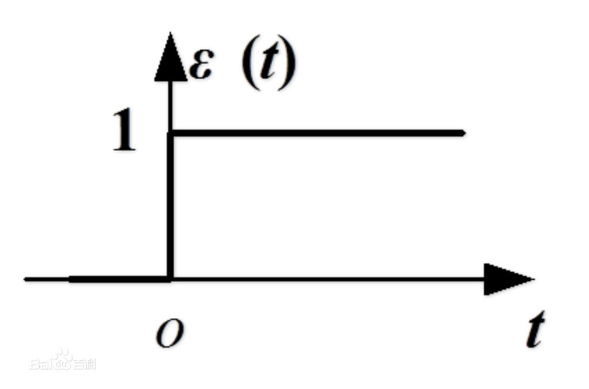
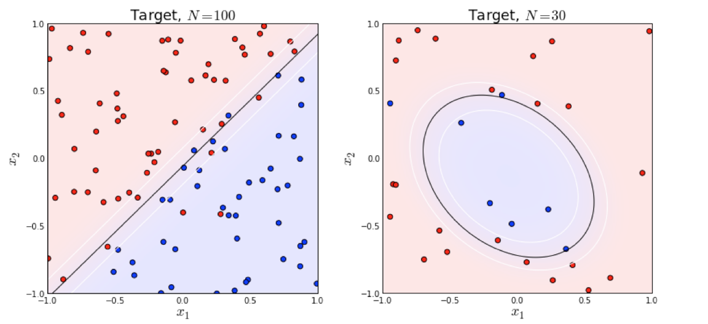
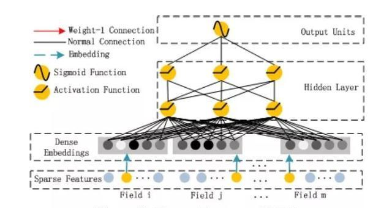
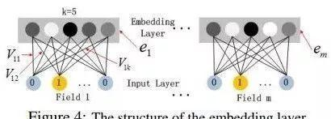

[TOC]

# 总述

> 线性模型LR: 没有考虑到特征之间关联

> LR + 多项式：特征组合，不适用于特征稀疏场景，泛化能力比较弱 

> FM： 适用于特征稀疏场景，泛化能力比较强

> FFM：省去零值特征，提升FFM模型训练和预测速度，这也是稀疏样本采用FFM的显著优势

# LR 推导

## 数学推导

LR是一种监督学习的分类算法，实现了给定数据集到0，1的映射。

数据集合： $D = {(x_1, y_1), (x_2, y_2), ..., (x_n, y_n)}$ 

$\hat y = \sigma(z) $

$\sigma(z) = \frac {1} {1 + e^{-z}}$

$z = w^Tx + b$

$p(y=1|x) = \hat y$

$p(y=0|x) = 1 - \hat y$

LR逻辑回归假设： 样本服从0-1的伯努利分布

$p(y|x;w) = \hat y ^ y * (1 - \hat y) ^ {1-y}$

对数损失函数: 最大化 $p(y|x;w)即最大化log(p(y|x;w))$

$log(p(y|x;w)) = y log(\hat y) + (1-y) log(1 - \hat y) = - L (y, \hat y)$

因此损失函数为： 即最大化 $log(p(y|x;w))$，就是最小化损失函数 $L(y, \hat y)$

$L(y, \hat y) = - y log(\hat y) - (1-y) log(1 - \hat y)$

成本函数（即m个训练样本）：假设所有样本都服从同一分布且相互独立，所有这些样本的联合概率分布，就是每个样本概率的乘积

$l(w) = \prod_{i=0}^m p(y_i|x_i; w) = \prod_{i=0}^m {\hat y ^ y * (1 - \hat y) ^ {1-y}}$

最大对数似然估计(需要寻找一组参数，使得给定的样本的观测值概率最大)

$log(l(w)) = \sum_{i=0}^m (y log(\hat y) + (1-y) log(1 - \hat y))$ 

因此，成本函数为

$J(w) = - \frac {1} {m} log(l(w)) = \frac {1} {m} \sum_{i=0}^m L(y, \hat y)$

## 问题

### 为什么不使用阶跃函数，而使用sigmod函数使z值转为0，1？

1. 阶跃函数性质不好
2. 不可导求解过于复杂

### 为什么要求最大对数似然函数而不是最大似然函数？

1. 为什么要取 -log 损失函数？因为损失函数的本质就是，如果预测对了，则不惩罚；相反预测错误，会导致损失函数变得很大。而 -log 在[0,1]之间正好符合这一点。
2. LR是广义线性回归模型，使用平方损失函数，对于sigmoid函数求导计算，不能保证是凸函数，在优化求解过程，可能是求得是局部最小值，而不是全局最小值。
3. 取完对数后，后续求解会比较方便
4. 如果根据似然函数直接计算，有两个缺点： （1）不利于后续求导  （2）似函数的计算会导致数据溢出
5. 除以m得到平均损失值，避免样本量对损失值的影响

### 逻辑回归为什么使用sigmoid

https://blog.csdn.net/u013385925/article/details/79666953

# 广义线性模型

https://www.jianshu.com/p/c99e7a2cf151 （逻辑回归（LR） 广义线性模型）

# LR如何解决线性不可分问题

https://www.jianshu.com/p/dce9f1af7bc9

## 利用核函数，对特征进行变换

把低维空间转换到高维空间，在低维空间线性不可分的数据，在高维空间线性可分的概率会大一些

### 举例

#### 举例1: 使用核函数(特征组合映射)

针对线性不可分数据集，可以尝试对给定的两个feature做一个多项式特征的映射，例如

下面两个图的对比说明了线性分类曲线和非线性分类曲线（通过特征映射）

左图是一个线性可分的数据集；右图在原始空间中线性不可分，可以利用核函数，对特征进行转换，
$例如[x_1, x_2] => [x_1, x_2, x_{11}, x_{12}, x_{22}]$

#### 举例2: LR中，在线性回归的基础上引入交叉项，来实现非线性分类

$z = \sum_{i=1}^m w_ix_i + \sum_{i=1}^{m-1} \sum_{j=i+1}^m w_{ij}x_ix_j + b$

### 优点：实现了非线性

### 缺点：组合特征泛化能力弱

> 特征的稀疏性，每个参数$w_{ij}的训练都需要大量的x_i和x_j$都非零的样本；由于特征本来就比较稀疏，满足$x_i， x_j$都非零的样本将会非常少 

> 训练样本不足，很容易导致参数$w_{ij}$不准确，最终影响模型性能 

### 为什么会特征稀疏？

在机器学习中，尤其是广告领域，特征很多时候都是分类值，对于categorical feature，通常会使用one-hot encoding转为数值型特征，转化过程会产生大量的稀疏数据。

可以这么理解：对于每一个特征，如果有m个不同的取值，经过one-hot encoding之后，会变成m 个二元特征，并且，这些特征都是互斥，每次只激活一个特征，因此数据会变得非常稀疏。

### LR为什么要对连续数值特征进行离散化？

李沐曾经说过：模型是使用离散特征还是连续特征，其实是一个“海量离散特征+简单模型” 同 “少量连续特征+复杂模型”的权衡。既可以离散化用线性模型，也可以用连续特征加深度学习。就看是喜欢折腾特征还是折腾模型了。通常来说，前者容易，而且可以n个人一起并行做，有成功经验；后者目前看很赞，能走多远还须拭目以待

> 离散特征的增加和减少都很容易，易于模型的快速迭代；

> 稀疏向量内积乘法运算速度快，计算结果方便存储，容易扩展；

> 离散化后的特征对异常数据有很强的鲁棒性：比如一个特征是年龄>30是1，否则0。如果特征没有离散化，一个异常数据“年龄300岁”会给模型造成很大的干扰；

> 逻辑回归属于广义线性模型，表达能力受限；单变量离散化为N个后，每个变量有单独的权重，相当于为模型引入了非线性，能够提升模型表达能力，加大拟合；

> 离散化后可以进行特征交叉，由M+N个变量变为M*N个变量，进一步引入非线性，提升表达能力；

> 特征离散化后，模型会更稳定，比如如果对用户年龄离散化，20-30作为一个区间，不会因为一个用户年龄长了一岁就变成一个完全不同的人。当然处于区间相邻处的样本会刚好相反，所以怎么划分区间是门学问；

> 特征离散化以后，起到了简化了逻辑回归模型的作用，降低了模型过拟合的风险。

## 扩展LR算法，提出FM算法

# LR和SVM的区别和联系

## 什么是参数模型(LR)与非参数模型(SVM)？

在统计学中，参数模型通常假设总体(随机变量)服从每一个分布，该分布由一些参数确定(比如正太分布由均值和方差确定)，在此基础上构建的模型称为参数模型；

非参数模型对样本总体不做任何假设，只是知道总体是一个随机变量，其分布是存在的(分布中也有可能存在参数)， 但无法知道分布的形式，更不知道分布的相关参数，只是在给定的一些样本条件下，能够依据非参数统计的方法进行推断

## LR和SVM联系

1. 都可以处理分类问题(在改进的情况下可以处理多分类问题)
2. 都可以增加不同的正则项，如L1,L2，在很多式样中，两种算法的结果很接近

## LR和SVM区别

1. 模型类别：LR属于参数模型[LR假设样本服从Bernoulli分布], SVM属于非参数模型
2. 目标函数：LR采用Logistical Loss， SVM采用Hinge loss。两个损失函数的目的都是增加对分类影响较大的数据点的权重，减少与分类无关的数据点的权重
3. 数据敏感度：LR对异常点敏感；SVM对异常点不敏感，值关心支持向量，且需要先做归一化
4. 处理方法：LR通过非线性映射，大大减少了离分类平面较远的点的权重，相对提升与分类最相关的数据点的权重；SVM只考虑支持向量，也即是和分类最相关的少数点去学习分类器。
5. 模型复杂度：LR简答、易理解、大规模线性分类时比较方便；SVM理解和优化相对来说复杂，可以处理非线性问题
6. LR能做的SVM能做，SVM能做的LR做不了

## LR和SVM如何选择？

1. 如果Feature的数量很大，跟样本数量差不多，这时候选用LR或者是Linear Kernel的SVM
2. 如果Feature的数量比较小，样本数量一般，不算大也不算小，选用SVM+Gaussian Kernel
3. 如果Feature的数量比较小，而样本数量很多，需要手工添加一些feature变成第一种情况。

# FFM

FFM 把相同性质的特征归于同一个filed。例如，广告分类为例，“Day=26/11/15”、“Day=1/7/14”、“Day=19/2/15”这三个特征都是代表日期的，可以放到同一个field中。同理，商品的末级品类编码生成了550个特征，这550个特征都是说明商品所属的品类，因此它们也可以放到同一个field中。简单来说，同一个categorical特征经过One-Hot编码生成的数值特征都可以放到同一个field，包括用户性别、职业、品类偏好等。

在FFM中，每一维特征 $x_i$，针对其它特征的每一种field $f_j$，都会学习一个隐向量 
$v_{i,f_j}$。因此，隐向量不仅与特征相关，也与field相关。也就是说，“Day=26/11/15”这个特征与“Country”特征和“Ad_type”特征进行关联的时候使用不同的隐向量，这与“Country”和“Ad_type”的内在差异相符，也是FFM中“field-aware”的由来。

## FFM理论

假设样本的n个特征属于 f 个field，那么FFM的二次项有 nf 个隐向量。而在FM模型中，每一维特征的隐向量只有一个，因此FM可以看作FFM的特例，是把所有特征都归于一个field时的FFM模型。根据FFM的field敏感特性，可以导出模型方程为：

$y(x) = w_0 + \sum_{i=1}^n w_i x_i + \sum_{i=1}^{n-1} \sum_{j=i+1}^n <v_{i,f_j}, v_{j,f_i}> x_i x_j $

其中， $f_j$是第j个特征的所属的filed。如果隐向量的长度为k，那么FFM的二次参数有 nfk个，远多于FM模型的nk个。
此外，由于隐向量与field相关，FFM二次项并不能够化简，其预测复杂度为 O(kn^2)

下面以一个例子简单说明FFM的特征组合方式[9]。输入记录如下

这条记录可以编码成5个特征，其中“Genre=Comedy”和“Genre=Drama”属于同一个field，“Price”是数值型，不用One-Hot编码转换。为了方便说明FFM的样本格式，我们将所有的特征和对应的field映射成整数编号。

那么，FFM的组合特征有10项，如下图所示。

其中，红色是field编号，蓝色是特征编号，绿色是此样本的特征取值。二次项的系数是通过与特征field相关的隐向量点积得到的，二次项共有 $/frac {n(n−1)}{2}$ 个。

## FFM损失函数

这里讲得只是一种FFM的实现方式，并不是唯一的。FFM将问题定义为分类问题，使用的是logistic loss，同时加入了正则项

$min_w \sum_{i=1}^L log(1 + exp{-y_i \phi(w, x_i)}) + \lambda / 2 ||w||^2 $

where $y_i \in {-1, 1}$

## FFM实战

https://github.com/princewen/tensorflow_practice/tree/master/recommendation-FFM-Demo

## FFM优缺点

- 优点： 细化隐向量的表示，同一特征针对不同的filed使用不同的隐向量，模型建模更加准确

- 缺点：计算复杂度比较高，参数个数为 nkf，计算复杂度为O(k * n^2)

## 使用FFM需要注意的地方

- 样本归一化。否则容易造成数据溢出，梯度计算失败
- 特征归一化。消除不同特征取值范围不同，量纲不同造成问题。
- FFM容易过拟合。因此可以采用dropout
- 省略零值特征。零值特征对模型没有任何贡献，不论是1次项还是2次项都为0

# DeepFM

在基于CTR预估的推荐系统中，最重要的是学习到用户 点击行为背后隐藏的特征组合。 在不同的推荐场景中低阶特征组合或者高阶特征组合 可能都会对最终的CTR产生影响。

## DeepFM提出的原因

### 人工特征工程存在的两个问题

1. 特征爆炸。通常使用的Poly-2模型为例，该模型采用直接对2阶特征组合建模来学习权重，这种方式构造的特征数据量跟特征个数乘积相关。
2. 大量重要的特征组合隐藏在数据中，无法被专家识别或者设计。

### 广度模型

针对人工特征工程存在的两个问题，广度模型和深度模型都提出了不同的解决思路。其中广度模型包括FM/FFM等大规模低秩(Low-Rank)模型, FM/FFM 通过对特征的低秩展开，为每个特征构造隐士向量，并通过隐士向量的点乘结果来建模两个特征的组合关系，从而实现对二阶特组合的自动学习。

FM/FFM相对于Poly-2优势有如下两点：

1. FM/FFM模型所需要的参数个数远小于Poly-2模型，所需要的参数个数为 O(nm)，其中k 为隐式向量维度，n为特征个数；Poly-2模型为每个二阶特征组合需要的参数个数为O(m^2)。poly-2在特征进行one-hot之后，样本会变得稀疏。
2. 相比于Poly-2，FM/FFM能够更有效的学习参数（泛化能力强）。当一个2阶特征组合没有出现在训练集时，Poly-2模型则无法学习该特征组合的权重；但FM/FFM却依然可以学习，因为该特征组合的权重是由这2个特征的隐式向量点乘得到的，而这两个特征的隐式向量可以由别的特征组合学习到。例如：即使在训练数据中两个特征组合并为见过，意味着 $x_i， x_j$ 一起出现的次数为0，如果换做SVM、LR模式是无法学会着特特征组合的权重的。而对于FM学习的是单个特征的embedding，并不依赖某个特定的特征组合是否出现过，所以只要特征 $x_i$和其他任意特征组合出现过，那么就可以学习到自己对应的embedding向量。因此可以通过内积计算出这个新特征组合的权重，这也可是说是FM模型泛化能力强的根本原因。

总之，FM/FFM是一种有效地对二阶特征组合进行自动学习的模型

### 深度模型

通过神经网络结构和非线性激活函数，自动学习特征之间复杂的组合关系。目前在APP推荐领域中比较流行的深度模型有FNN/PNN/Wide and Deep。

FNN模型：用FM模型来对Embedding层进行初始化的全连接神经网络。

PNN模型：在Embedding层和全连接层之间引入内积/外积 层，来学习特征之间的交互关系

Wide and Deep模型：将LR和DNN联合训练

### DeepFM模型优势

广度模型(LR/FM/FFM)的局限：一般只能学习1阶，2阶特征组合

深度模型(FNN/PNN)的局限：一般学习的是高阶特征组合

Wide and Depp局限：依然需要人工特征工程来为Wide模型选取输入特征

DeepFM模型：结合了广度和深度模型的优点，联合训练FM和DNN模型，同时学习低阶和高阶特征组合。

无论是低阶特征组合还是高阶特征组合，对推荐效果都是非常重要的 ，其中总结DeepFM优点有如下两点：

1. DeepFM模型同时对低阶特征组合和高阶特征组合建模，从而能够学习到各阶特征之间的组合关系
2. DeepFM模型是一个端到端的模型，不需要任何的人工特征工程

此外，DeepFM模型的Deep component和FM component从Embedding层共享数据输入，这样做的好处是Embedding层的隐式向量在(残差反向传播)训练时可以同时接受到Deep component和FM component的信息，从而使Embedding层的信息表达更加准确而最终提升推荐效果

## DeepFM 算法原理

DeepFM系统框图

DeepFM包含两部分，左边的FM部分和右边的DNN部分。这两部分共享相同的输入。对于给定的特征i, $w_i$用于表示一阶特征的重要性，特征i的隐向量(latent vector) $V_i$ 用户表示和其他特征的相互影响。在FM部分，$V_i$ 用于表征二阶特征，同时在神经网络部分用于构建高阶特征。对于当前模型，所有的参数共同参与训练。DeepFM的预测结果可以写为

$y = sigmoid (y_{FM} + y_{DNN})$

$y \in (0, 1)$ 是预测的CTR， $y_{FM}$ 是FM部分得到的结果， $y_{DNN}$是DNN部分的结果

对于FM部分

$y_{FM} = w_0 + \sum_{i=1}^n w_i x_i + \sum_{i=1}^{n-1} \sum_{j=i+1}^n <v_i, v_j> x_i x_j$

对于神经网络DNN部分，其模型如下所示

深度部分是一个前馈神经网络，可以学习高阶的特征组合。需要注意的是原始的输入的数据是很多个字段的高维稀疏数据。因此引入一个embedding layer将输入向量压缩到低维稠密向量。 
embedding layer的结构如下图所示，

embedding layer有两个有趣的特性：

- 输入数据的每个字段的特征经过embedding之后，都为k维(lantent vector的维度),所以embedding后的特征维度是 字段数×k
- 在FM里得到的隐变量V现在作为了嵌入层网络的权重,FM模型作为整个模型的一部分与其他深度学习模型一起参与整体的学习, 实现端到端的训练。

## reference

[DeepFM 论文](https://arxiv.org/pdf/1703.04247.pdf)

[CTR预估算法之FM, FFM, DeepFM及实践](https://blog.csdn.net/John_xyz/article/details/78933253)

[美团-深入FFM原理与实践](https://tech.meituan.com/2016/03/03/deep-understanding-of-ffm-principles-and-practices.html)

[推荐系统遇上深度学习(二)--FFM模型理论和实践](https://cloud.tencent.com/developer/article/1096536)

[FFM 论文](https://www.csie.ntu.edu.tw/~cjlin/papers/ffm.pdf)

[libffm](https://github.com/guestwalk/libffm)