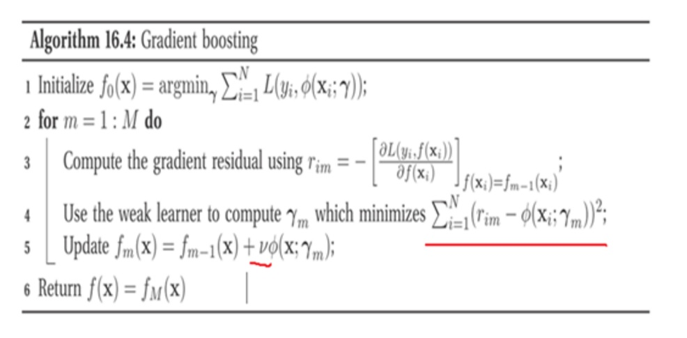

# LambdaMART算法

LambdaMART是Learning to rank其中的一个算法，在Yahoo! Learning to Rank Challenge比赛中夺冠队伍用的就是这个模型。

LambdaMART模型从名字上可以拆分成Lambda和MART两部分，训练模型采用的是MART也就是GBDT，lambda是MART求解使用的梯度，其物理含义是一个待排序文档下一次迭代应该排序的方向。

但Lambda最初并不是诞生于LambdaMART，而是在LambdaRank模型中被提出，而LambdaRank模型又是在RankNet模型的基础上改进而来。所以了解LambdaRank需要从RankNet开始说起。

# LambdaMart 和GBDT算法对比

我们知道GBDT算法每一次迭代中， 需要学习上一次结果和真实结果的残差。在lambdaMART中，每次迭代用的并不是残差，lambda在这里充当替代残差的计算方法。

## LambdaMART 算法流程

## GBDT算法流程

对比lambdaMART和GBDT算法流程，主要框架是相同的，只不过LambdaMART模型用lambda梯度代替了GBDT的残差。

## TODO

[机器学习算法-L2R进一步了解](https://jiayi797.github.io/2017/09/25/%E6%9C%BA%E5%99%A8%E5%AD%A6%E4%B9%A0%E7%AE%97%E6%B3%95-L2R%E8%BF%9B%E4%B8%80%E6%AD%A5%E4%BA%86%E8%A7%A3/)

