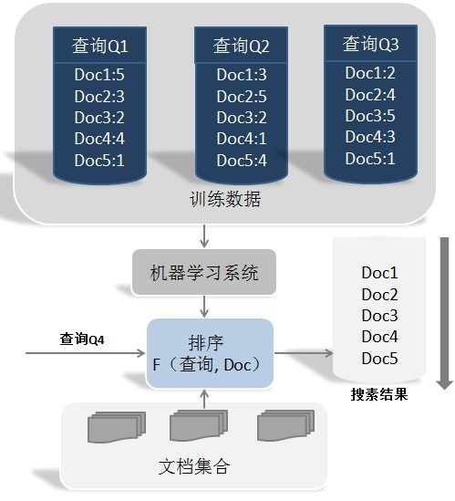
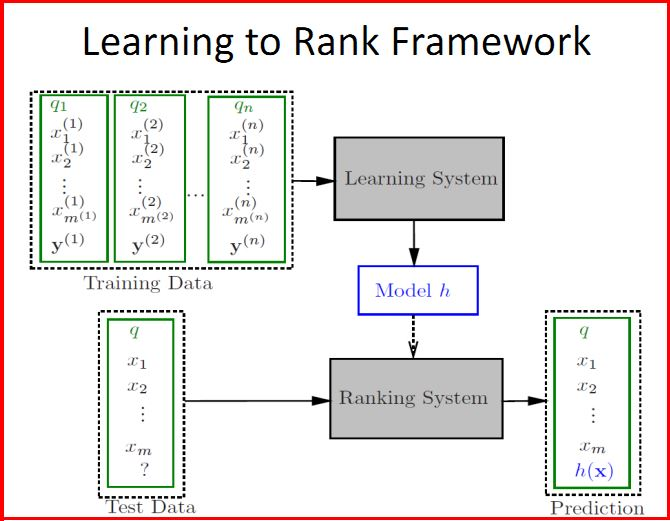
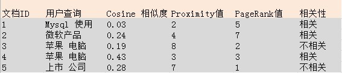
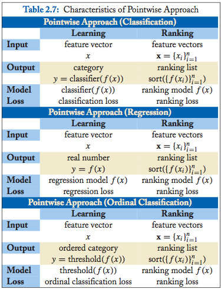
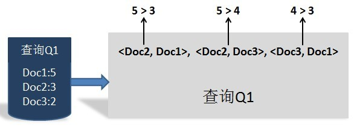
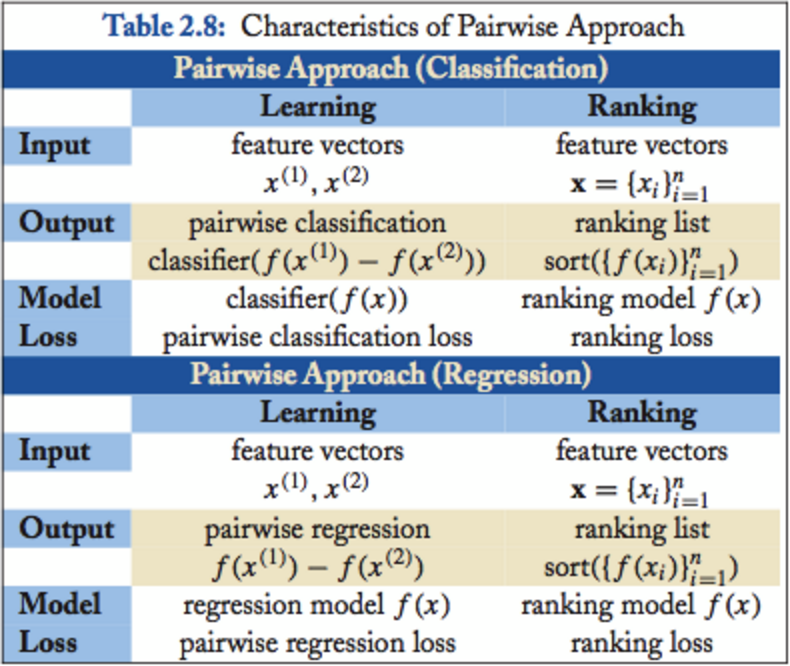
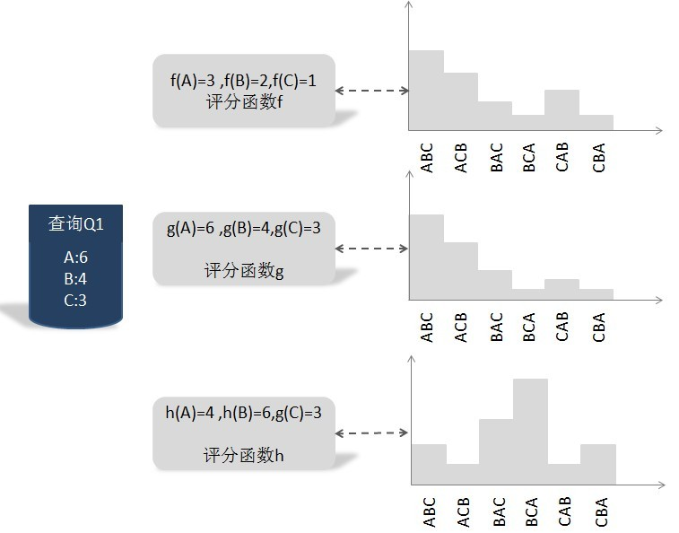
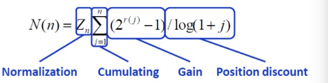
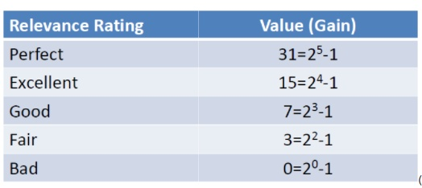

# Learning to Rank

[TOC]

## 互联网搜索经历的三代技术发展阶段

> 第一代技术，将互联网网页看作文本，主要采用传统信息检索的方法。

> 第二代技术，利用互联网的超文本结构，有效地计算网页的相关度与重要度，代表的算法有 PageRank 等。

> 第三代技术，有效利用日志数据与统计学习方法，使网页相关度与重要度计算的精度有了进一步的提升，代表的方法包括排序学习、网页重要度学习、匹配学习、话题模型学习、查询语句转化学习。

## 传统排序模型

排序(Ranking)一直是信息检索的核心研究问题，有大量的成熟的方法，主要可以分为以下两类：相关度排序模型和重要性排序模型。

### Relevance Ranking Model(相关度排序模型)

>  相关度排序模型根据查询和文档之间的相似度来对文档进行排序。常用的模型包括：布尔模型(Boolean Model)，向量空间模型(Vector Space Model)，隐语义分析(Latent Semantic Analysis)，BM25，LMIR模型等等。

### Importance Ranking Model(重要性排序模型)

> 重要性排序模型不考虑查询，而仅仅根据网页(亦即文档)之间的图结构来判断文档的权威程度，典型的权威网站包括Google，Yahoo!等。常用的模型包括PageRank，HITS，HillTop，TrustRank等等。

## why Learning to Rank

信息检索领域已经发展了几十年，为何将机器学习技术和信息检索技术相互结合出现较晚？主要有两方面的原因。

>一方面是因为：在前面几节所述的基本检索模型可以看出，用来对査询和文档的相关性进行排序，所考虑的因素并不多，主要是利用词频、逆文档频率和文档长度这几个因子来人工拟合排序公式。因为考虑因素不多，由人工进行公式拟合是完全可行的，此时机器学习并不能派上很大用场，因为机器学习更适合采用很多特征来进行公式拟合，此时若指望人工将几十种考虑因素拟合出排序公式是不太现实的，而机器学习做这种类型的工作则非常合适。随着搜索引擎的发展，对于某个网页进行排序需要考虑的因素越来越多，比如网页的pageRank值、查询和文档匹配的单词个数、网页URL链接地址长度等都对网页排名产生影响，Google目前的网页排序公式考虑200多种因子，此时机器学习的作用即可发挥出来，这是原因之一。

>另外一个原因是：对于有监督机器学习来说，首先需要大量的训练数据，在此基础上才可能自动学习排序模型，单靠人工标注大量的训练数据不太现实。对于搜索引擎来说， 尽管无法靠人工来标注大量训练数据，但是用户点击记录是可以当做机器学习方法训练数据的一个替代品，比如用户发出一个查询，搜索引擎返回搜索结果，用户会点击其中某些网页,可以假设用户点击的网页是和用户查询更加相关的页面。尽管这种假设很多时候并 不成立，但是实际经验表明使用这种点击数据来训练机器学习系统确实是可行的。

## 机器学习的基本思路

传统的检索模型靠人工拟合排序公式，并通过不断的实验确定最佳的参数组合，以此来形成相关性打分函数。机器学习排序与此思路不同，最合理的排序公式由机器自动学习获得，而人则需要给机器学习提供训练数据。

机器学习排序系统由4个步骤组成：人工标注训练数据、文档特征抽取、学习分类函数、在实际搜索系统中采用机器学习模型。 

- 人工标注训练数据。也就是说，对于某个查询Q，人工标出哪些文档是和这个査询相关的，同时标出相关程度，相关程度有时候可以用数值序列来表示，比如从1分到5分为3个档次，1代表微弱相关，5代表最相关，其他数值代表相关性在两者之间。对于某个查询，可能相关文档众多，同时用户査询也五花八门，所以全部靠人工标注有时候 不太可能。此时，可以利用用户点击记录来模拟这种人工打分机制。

- 文档特征抽取，将文档转为特征向量。比较常用的特征包括：

      ·查询词在文档中的词频信息 

      ·查询词的IDF信息

      ·文档长度

      ·网页的入链数量

      ·网页的出链数量

      ·网页的pageRank值

      ·网页的URL松度

      ·査询词的Proximity值：即在文档中多大的窗口内可以出现所有査询词。

	以上所列只是影响排序的一部分特征，实际上还有很多类似的特征可以作为特征向量中的一维加入。在确定了特征数量后，即可将文档转換为特征向量X，前面说过每个文档会人工标出其相关性得分y。这样每个文档会转換为<X,Y>的形式，即特征向量及其对应的相关性得分，这样就形成了一个具体的训练实例。

## LTR分类

Ranking学习作为机器学习研究的一个新方向，在信息检索、协同滤波、专家发现等领域广泛应用。Ranking学习是指通过使用机器学习技术和有标签的数据来产生一个ranking模型，它是一种新的学习，一种介于分类和回归之间的学习。 主要有如下三种类型

### Pointwise Approach

单文档方法的处理对象是单独的一篇文档，将文档转换为特征向量后，机器学习系统根据从训练数据中学习到的分类或者回归函数对文档打分，打分结果即是搜索结果。

#### 缺点

缺点: PointWise方法学习到全局相关性，并不对文档先后顺序的优劣做惩罚

#### 举例

> 下面我们用一个简单的例子说明这种方法。

> 

> 上图是人工标注的训练集合，在这个例子中，我们对于每个文档采用了3个特征： 査询与文档的Cosme相似性分值、査询词的Proximity值及页面的PageRank数值，而相关性判断是二元的，即要么相关要么不相关，当然，这里的相关性判断完全可以按照相关程度扩展为多元的，本例为了方便说明做了简化。

>  例子中提供了5个训练实例，每个训练实例分别标出来其对应的查询，3个特征的得分情况及相关性判断。对于机器学习系统来说，根据训练数据，需要如下的线性打分函数： Score(Q, D)=a x CS+b x PM+cx PR+d 
>  这个公式中，CS代表Cosine相似度变徽，PM代表Proximity值变量，PR代表pageRank， 而a、b、c、d则是变量对应的参数。

> 如果得分大于设定阀值，则叫以认为是相关的， 如果小于设定闽值则可以认为不相关。通过训练实例，可以获得最优的a、b、c、d参数组合，当这些参数确定后，机器学习系统就算学习完毕，之后即可利用这个打分函数进行相关性判断。对于某个新的查询Q和文档D，系统首先获得其文档D对应的3个特征值，之后利用学习到的参数组合计算两者得分，当得分大于设定的闽值，即可判断文档是相关文档，否则判断为不相关文档。

#### 常用算法

其主要区别就是loss function不同，也就是最后的结果目标不一样:

Classification:输入的是5档类别（作为离散），最后通过分类模型输测试数据的各个档位档位的概率，然后进行加权成一个实数值
Regression:输入的是5档或者2档（作为连续），最后通过回归模型输出测试数据的一个相关性实数(就是回归)
Ordinal Classification:输入的档位是有序的,比如像上面一样输入5档，但是他们的权重不一样，可能权重最高档位的分类（二分类），再进行次高档位的分词，依次下去(McRank的paper有讲)

##### Classification

Discriminative model for IR (SIGIR 2004)

McRank (NIPS 2007)

##### Regression

Least Square Retrieval Function (TOIS 1989)

Regression Tree for Ordinal Class Prediction (Fundamenta Informaticae, 2000)

Subset Ranking using Regression (COLT 2006)

##### Ordinal Classification

Pranking (NIPS 2002)

OAP-BPM (EMCL 2003)

Ranking with Large Margin Principles (NIPS 2002)

Constraint Ordinal Regression (ICML 2005)

### Pairwise Approach

对于搜索系统来说，系统接收到用户査询后，返回相关文档列表，所以问题的关键是确定文档之间的先后顺序关系。单文档方法完全从单个文档的分类得分角度计算，没有考虑文档之间的顺序关系。文档对方法则将重点转向量对文档顺序关系是否合理进行判断。

之所以被称为文档对方法，是因为这种机器学习方法的训练过程和训练目标，是判断任意两个文档组成的文档对<DOC1，DOC2>是否满足顺序关系，即判断是否DOC1应该排在DOC2的前面。图3展示了一个训练实例：査询Q1对应的搜索结果列表如何转换为文档对的形式，因为从人工标注的相关性得分可以看出，DOC2得分最高，DOC3次之，DOC1得分最低，于是我们可以按照得分大小顺序关系得到3个如图3所示的文档对，将每个文档对的文档转换为特征向量后，就形成了一个具体的训练实例。

#### 缺点

- 位置问题。文档对只考虑了两个文档对的相对先后顺序，没有考虑到文档出现在搜索列表中的位置，排在搜索站果前列的文档更为重要，如果前列文档出现判断错误，代价明显高于排在后面的文档。针对这个问题的改进思路是引入代价敏感因素，即每个文档对根据其在列表中的顺序具有不同的权重，越是排在前列的权重越大，即在搜索列表前列如 果排错顺序的话其付出的代价更高

- 效果评价指标困难。不同的査询，其相关文档数量差异很大，所以转换为文档对之后， 有的查询对能有几百个对应的文档对，而有的查询只有十几个对应的文档对，这对机器学习系统的效果评价造成困难 ?我们设想有两个查询，査询Q1对应500个文文档对，查询Q2 对应10个文档对，假设学习系统对于査询Ql的文档对能够判断正确480个，对于査询 Q2的义格对能够判新正确2个，如果从总的文档对数量来看，这个学习系统的准确率是 (480+2)/（500+10）=0.95.即95%的准确率，但是从査询的角度，两个査询对应的准确率 分别为：96%和20%,两者平均为58%,与纯粹从文档对判断的准确率相差甚远，这对如何继续调优机器学习系统会带来困扰。

#### 常用算法

Learning to Retrieve Information (SCC 1995)

Learning to Order Things (NIPS 1998)

** Ranking SVM (ICANN 1999) **

** RankBoost (JMLR 2003) **

LDM (SIGIR 2005)

** RankNet (ICML 2005) **

** Frank (SIGIR 2007) **

MHR(SIGIR 2007)

Round Robin Ranking (ECML 2003)

** GBRank (SIGIR 2007) **

QBRank (NIPS 2007)

MPRank (ICML 2007)

** IRSVM (SIGIR 2006) **

LambdaRank (NIPS 2006)

### Listwise Approach

单文档方法将训练集里每一个文档当做一个训练实例，文档对方法将同一个査询的搜索结果里任意两个文档对作为一个训练实例，文档列表方法与上述两种表示方式不同，是将每一个查询对应的所有搜索结果列表整体作为一个训练实例

#### 举例

文档列表方法根据K个训练实例（一个査询及其对应的所有搜索结果评分作为一个实 例）训练得到最优评分函数F， 对于一个新的用户査询，函数F 对每一个文档打分，之后按照得分顺序由高到低排序，就是对应的搜索结果。 所以关键问题是：拿到训练数据，如何才能训练得到最优的打分函数？这里介绍一种训练方法，它是基于搜索结果排列组合的概率分布情况来训练

首先解释下什么是搜索结果排列组合的概率分布，我们知道，对于搜索 引擎来说，用户输入査询Q， 搜索引擎返回搜索结果，我们假设搜索结果集合包含A. B 和C 3个文档，搜索引擎要对搜索结果排序，而这3个文档的顺序共有6种排列组合方式:
ABC, ACB, BAG, BCA, CAB和CBA,

而每种排列组合都是一种可能的搜索结果排序方法。

对于某个评分函数F来说，对3个搜索结果文档的相关性打分，得到3个不同的相关度得分F(A)、 F(B)和F(C)， 根据这3个得分就可以计算6种排列组合情况各自的概率值。 不同的评分函数，其6种搜索结果排列组合的概率分布是不一样的。了解了什么是搜索结果排列组合的概率分布，我们介绍如何根据训练实例找到最优的 评分函数。图中展示了一个具体的训练实例，即査询Q1及其对应的3个文档的得分情况，这个得分是由人工打上去的，所以可以看做是标准答案。可以设想存在一个最优的评分函数g，对查询Q1来说，其打分结果是：A文档得6分，B文档得4分，C文档得3分， 因为得分是人工打的，所以具体这个函数g是怎样的我们不清楚，我们的任务就是找到一 个函数，使得函数对Ql的搜索结果打分顺序和人工打分顺序尽可能相同。既然人工打分 (虚拟的函数g) 已知，那么我们可以计算函数g对应的搜索结果排列组合概率分布，其具体分布情况如图4中间的概率分布所示。假设存在两个其他函数h和f，它们的计算方法已知，对应的对3个搜索结果的打分在图上可以看到，由打分结果也可以推出每个函数对应的搜索结果排列组合概率分布，那么h与f哪个与虚拟的最优评分函数g更接近呢？一般可以用两个分布概率之间的距离远近来度量相似性，KL距离就是一种衡量概率分布差异大小的计算工具，通过分别计算h与g的差异大小及f与g的差异大小，可以看出f比h更接近的最优函数g，那么在这个函数中，我们应该优先选f作为将来搜索可用的评分函数，训练过程就是在可能的函数中寻找最接近虚拟最优函数g的那个函数作为训练结果，将来作为在搜索时的评分函数。

上述例子只是描述了对于单个训练实例如何通过训练找到最优函数，事实上我们有K 个训练实例，虽然如此，其训练过程与上述说明是类似的，可以认为存在一个虚拟的最优 评分函数g(实际上是人工打分），训练过程就是在所有训练实例基础上，探寻所有可能的 候选函数，从中选择那个KL距离最接近于函数g的，以此作为实际使用的评分函数。 经验结果表明，基于文档列表方法的机器学习排序效果要好于前述两种方法。

#### 缺点

#### 常用算法

##### Measure-specific

** AdaRank (SIGIR 2007) **

** SVM-MAP (SIGIR 2007) **

** SoftRank (LR4IR 2007) **

GPRank (LR4IR 2007)

LambdaMART(2010)([From RankNet to LambdaRank to LambdaMART: AnOverview](https://www.researchgate.net/publication/228936665_From_ranknet_to_lambdarank_to_lambdamart_An_overview))

##### Non-measure specific

** ListNet (ICML 2007) **

** ListMLE (ICML 2008) **

BoltzRank (ICML 2009)

## 评价指标

### MAP(Mean Average Precision)

假设有两个主题，主题1有4个相关网页，主题2有5个相关网页。某系统对于主题1检索出4个相关网页，其rank分别为1, 2, 4, 7；对于主题2检索出3个相关网页，其rank分别为1,3,5。对于主题1，平均准确率为(1/1+2/2+3/4+4/7)/4=0.83。对于主题2，平均准确率为(1/1+2/3+3/5+0+0)/5=0.45。则MAP= (0.83+0.45)/2=0.64。

### NDCG(Normalized Discounted Cumulative Gain)

NDCG把相关度分为r个等级，如果r＝5，等级设定分别文2^5-1，2^4-1等等

CG（cumulative gain，累计增益）可以用于评价基于打分/评分的个性推荐系统。假设我们推荐k个物品，这个推荐列表的CGk计算公式如下：

$CG_k=\sum_{i=1}^k rel_i$

$rel_i$表示第k个物品的相关性或者评分。假设我们共推荐k个电影，$rel_i$可以是用户对第i部电影的评分。

比如豆瓣给用户推荐了五部电影，

$M_1,M_2,M_3,M_4,M_5$

该用户对这五部电影的评分分别是

5, 3, 2, 1, 2

那么这个推荐列表的CG等于

$CG_5=5+3+2+1+2=13$

CG没有考虑推荐的次序，在此基础之后我们引入对物品顺序的考虑，就有了DCG(discounted CG)，折扣累积增益。公式如下：

$DCG_k=\sum_{i}^{k} \frac{2^{rel_i}-1}{log_2(i+1)}$

比如豆瓣给用户推荐了五部电影，

$M_1,M_2,M_3,M_4,M_5$，

该用户对这五部电影的评分分别是

5, 3, 2, 1, 2

那么这个推荐列表的DCG等于

$DCG_5=\frac{2^5 - 1}{log_2 2} + \frac{2^3 - 1}{log_2 3} + \frac{2^2 - 1}{log_2 4} + \frac{2^1 - 1}{log_2 5} + \frac{2^2 - 1}{log_2 6}=31+4.4+1.5+0.4+1.2=38.5$

DCG没有考虑到推荐列表和每个检索中真正有效结果个数，所以最后我们引入NDCG(normalized discounted CG)，顾名思义就是标准化之后的DCG。

$NDCG_k=\frac{DCG_k} {IDCG_k}$

其中IDCG是指ideal DCG，也就是完美结果下的DCG。

继续上面的例子，如果相关电影一共有7部

$M_1,M_2,M_3,M_4,M_5,M_6,M_7$

该用户对这七部电影的评分分别是

5, 3, 2, 1, 2 , 4, 0

把这7部电影按评分排序

5, 4, 3, 2, 2, 1, 0

这个情况下的完美DCG是

$IDCG_5=\frac{2^5 - 1}{log_2 2} + \frac{2^4 - 1}{log_2 3} + \frac{2^3 - 1}{log_2 4} + \frac{2^2 - 1}{log_2 5} + \frac{2^1 - 1}{log_2 6} + =31+9.5+3.5+1.3+1.2=46.5$

所以

$NDCG_5=\frac{DCG_5}{IDCG_5} = \frac{38.5}{46.5}=0.827$

NDCG是0到1的数，越接近1说明推荐越准确。

## reference

[1801.10402 Deep Multi-view Learning to Rank](https://arxiv.org/pdf/1801.10402.pdf)

[Home site of Purushottam Kar](https://www.cse.iitk.ac.in/users/purushot/posters.php)

[Learning with Pairwise Losses for Purushottam Kar](https://www.cse.iitk.ac.in/users/purushot/slides/e0370-lecturepairwise.pdf)

[Deep Multi-view Learning to Rank](https://arxiv.org/pdf/1801.10402.pdf)

[Microsoft Learning to Rank Datasets](https://www.microsoft.com/en-us/research/project/mslr/?from=http%3A%2F%2Fresearch.microsoft.com%2Fen-us%2Fprojects%2Fmslr%2F)

[机器学习排序之Learning to Rank简单介绍](https://blog.csdn.net/Eastmount/article/details/42367515)

[维基百科介绍 Learning to rank](https://en.wikipedia.org/wiki/Learning_to_rank)

[开源软件 Rank SVM Support Vector Machine for Ranking ](http://www.cs.cornell.edu/people/tj/svm_light/svm_rank.html)

[开源软件 RankLib包括RankNet RankBoost AdaRank]()

[论文《Adapting Ranking SVM to Document Retrieval By:Tie-Yan Liu》]()

[论文《Learning to rank From Pairwise Approach to Listwise Approace》]()

[Learning to Rank for Information Retrieval By:Tie-Yan Liu]()
