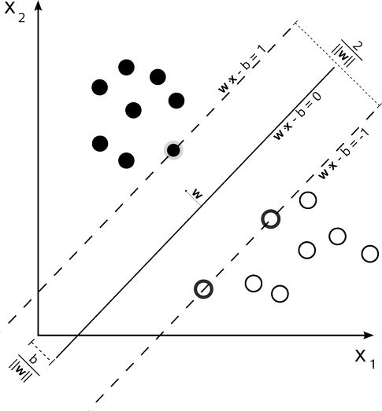
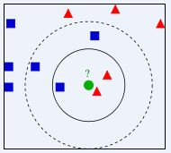

# 机器学习分类

## 监督学习

## 无监督学习

> 在无监督学习中，数据并不被标识，学习模型是为了推断数据的一些内在结构

> 常见的场景包括关联规则、聚类的学习。常见的算法包括Apriori及K-Means

## 半监督学习

> 半监督学习，输入数据部分被标识，部分没有被标识

> 如图论推理算法(Graph Inference)、拉普拉斯支持向量机(Laplacian SVM)

## 强化学习

> 在强化学习模式下，输入数据作为对模型的反馈，不像监督模型那样，输入数据仅仅是作为一个检查模型对错的方式

> 应用场景包括动态系统、机器人空值

> 常见算法包括Q-Learning、时间差学习(Temporal difference learning)


# 各大机器学习算法比较

## bias and variance

> 在统计学中，一个模型的好坏，是根据偏差和方差来衡量的

> bias： 描述的是预测值的期望E与真实值Y之间的差距。差距越大，越偏离真实数据

> variance: 描述的预测值P的变化范围，离散程度，是预测值的方差，也就是离其期望值E的距离。方差越大，数据分布越分散

> 模型的真实误差 Err = bias + variance

> 如果小训练集，高偏差/低方差的分类器要比低偏差/高方差分类器的优势大，因为后者会过拟合;
随着训练集增长，模型对原始数据的预测能力就越好，偏差降低，此时低偏差/高方差分类器就逐渐表现其优势


## 回归算法
###  Logistic Regression (属于判别模型)

#### 优点

> 实现简单，广泛用于工业问题上

> 分类时计算量非常小，速度快，存储资源低

> 对逻辑回归，多重共线性可以结合L2正则化来解决该问题

> 便利的观测样本概率分数

#### 缺点

> 只能处理而分类问题(softmax 可用于多分类)， 且线性可分；对于非线性特征，需要进行转换

> 当特征空间较大时，逻辑回归的性能不是很好

> 容易欠拟合

> 需要复杂的特征工程


### 线性回归

#### 优点

> 实现简单，计算简单

#### 缺点

> 不能拟合非线性数据


## 决策树

### 优点

> 计算简单，易于理解，可解释性强

> 比较适合处理有缺失属性的样本

> 比较适合大型数据源并且效果良好

> 不用担心异常值或者数据是否线性可分

### 缺点

> 不支持在线学习。因为新样本进来后需要重新建立决策树

> 容易出现过拟合。这也是随机森林/提升树之类的集成方法的切入点

> 忽略了特征之间的相关性

> 对于哪些类别样本数量不一致的数据，在决策树中，信息增益的结果偏向于哪些具有更多数值的特征(只要是使用信息增益，都有这个缺点)


## Adaboosting (Adaptive boosting)

> 是一种加权模型，每个模型都是基于上一次模型的错误率来建立，过分的关注分错的样本，而对正确分类的样本减少关注度。

### 优点

> Adaboost 算法提供的是框架，可以使用各种方法构建子分类器

### 缺点


## 朴素贝叶斯

> 朴素贝叶斯属于生成模型

> 朴素贝叶斯是高偏差/第方差模型：因为它假设各个数据之间是无关的，是一个被严重简化了的模型。所以，对于
这样一个简单模型，大部分场合bias都会大于variance

### 算法介绍

```bash
后验概率通过先验概率来求解
1. 令 x = {a1, a2, ..., am}为一个待分类项，a为x的一个特征
2. 类别集合 y = {y1, y2, ..., yk}
3. 计算 P(y1|x), P(y2|x), ..., P(yk|x)
4. P(yk|x) = max{P(y1|x), P(y2|x), ..., P(yk|x)}
```

### 优点

> 对小规模数据表现良好，能处理多个分类任务，适合增量训练

> 对缺失数据不敏感

> 如果注有条件独立性假设，朴素贝叶斯的收敛速度将快于判别模型，如逻辑回归，所以只需要较少的训练数据即可。
即使NB条件独立假设不成立，NB分类器在实践中表现也很出色

### 缺点

> 需要计算先验概率

> 对输入数据的表达形式很敏感

> 不能学习特征之间的相互作用，集特征冗余。比如，虽然你喜欢A和B的电影，但不能学习你不喜欢出A和B在一起演的电影


## SVM

### 算法介绍

```bash
1. SVM可以同时最小化经验误差与最大化几何边缘
2. 同时SVM将向量映射到一个更高维的空间里，在这个空间里构建一个最大间隔超平面。在分开数据的超平面两边，建有两个
互相平行的超平面，分隔超平面使两个平行超平面的距离最大化。平行超平面间的距离或者差距越大，分类器的总误差越小
```



### 优点

> 非线性可分问题中表现优秀

> 可以解决高维问题，即大型特征空间

> 能够处理非线性特征的相互作用

> 无需依赖整个数据(只需要超平面附近的支持向量)，可以提供泛化能力

> 核技术，典型的特征就是可以将低维的空间映射到高维的空间。包括线性核函数、多项式核函数、径向基函数

### 缺点

> 对缺失数据敏感

> 非线性问题，找核函数比较难


## KNN

### 算法介绍



```bash
1. K-近邻算法如上图，绿色圆是待分类的数据
2. K = 3 时，绿色圆点的三个邻居为2红1蓝 => 少数服从多数，绿色圆点为红色
3. K = 5 时，同理 => 绿色圆点为蓝色

```

### 优点

> 可用于非线性

> 没有对数据假设，准确度高

> 稀有事件分类上，KNN优于SVM

### 缺点

> 计算量大，需要大量内存

> 样本不平衡问题(即有的类别样本数量很多，而其它样本的数量很少)


## 人工神经网络

### 优点

> 分类准确度高

> 并行处理能力强，分布式存储及学习能力强

> 对噪声有较强的鲁棒性和容错能力

> 能充分逼近复杂的非线性关系

### 缺点

> 神经网络的参数、网络拓扑接口、初始值等调整复杂

> 不易观察学习过程，输出结果很难解释

> 训练需要强大的硬件资源，如GPU等


## K-Means 聚类

### 优点

> 非监督学习

### 缺点

> K值比较难选择

> 对初始簇心值敏感，对不同的初始值，可能会导致不同的聚类效果

> 对噪声和孤立点数据敏感


## gbdt

### 优点

> 非线性变化非常多，表达能力强

> 不需要复杂的特征工程和特征变化

### 缺点

> Boost是一个串行的过程，不好并行化

> 计算复杂度高

> 不太适合高维稀疏特征


## xgboost

### 优点

> 显示的把树模型的复杂度作为正则加到优化目标中.正则项包括了叶子结点个数、每个叶子结点输出score的L2模的平方和。

> xgboost损失函数部分是二阶泰勒展开，gdbt是一阶泰勒展开。支持自定义代价函数，只要函数可一阶、二阶可倒即可

> 利用了特征的稀疏性

> 数据事先排序并以block存储，有利于并行

> 对缺失值的处理。对于特征有缺失的样本，xgboost可以自动学习出它的分类方向

### 缺点


# reference
===
https://blog.csdn.net/u014365862/article/details/52937983 (8种常见机器学习算法比较)

http://blog.jobbole.com/92021/ (sk learn 10 种机器学习算法实例，稍后总结)

https://www.zhihu.com/question/27306416 (理论学习)

https://www.zhihu.com/question/54626685/answer/140610056 (机器学习算法中GBDT与Adaboost的区别与联系是什么)

https://www.cnblogs.com/mata123/p/7440774.html (lightgbm,xgboost,gbdt的区别与联系)

http://blog.jobbole.com/108395/ (轻松看懂机器学习十大常用算法)

https://chenrudan.github.io/blog/2016/01/09/logisticregression.html (【机器学习算法系列之二】浅析Logistic Regression)

https://blog.csdn.net/walilk/article/details/51107380 ([机器学习] Coursera ML笔记 - 逻辑回归（Logistic Regression）)
