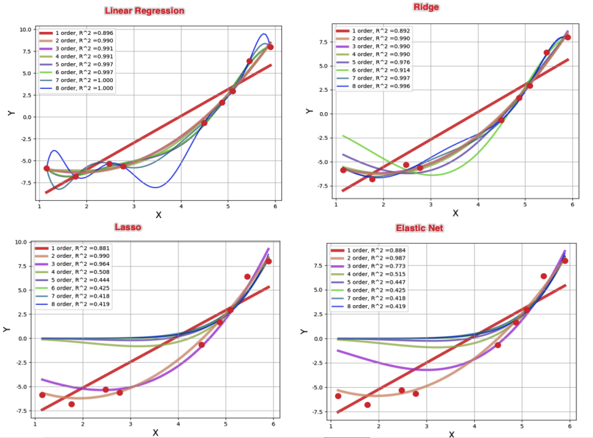

[TOC]

本小节将主要介绍线性回归中的模型中的数学原理推导。

# 回归的7种主要分类

## Linear Regression

## Logistic Regression

## Polynomial Regression

## Stepwise Regression

## Ridge Regression

- L2 正则

## Lasso Regression

- L1正则

## ElasticNet Regression

- L1 + L2正则

# 线性回归

## 线性回归介绍

- 定义

线性回归在假设特证满足线性关系，根据给定的训练数据训练一个模型，并用此模型进行预测。为了了解这个定义，我们先举个简单的例子；我们假设一个线性方程 Y=2x+1, x变量为商品的大小，y代表为销售量；当月份x =5时，我们就能根据线性模型预测出 y =11销量；对于上面的简单的例子来说，我们可以粗略把 y =2x+1看到回归的模型；对于给予的每个商品大小都能预测出销量；当然这个模型怎么获取到就是我们下面要考虑的线性回归内容

在现实中影响销量（y）的因素好有很多，我们就拿商品大小（x₁)，商品价格为例 (x₂)为例: 在机器学习之前，获取数据是第一步（无米难巧妇之炊），假定我们的样本如下：其中x1 为商品的大小，x2 为商品的价格，y 为商品的销量；


## 线性回归模型数学推导

为了推导模型，在假设数据满足线性模型条件下，可以设定线性模型为;x1特征为商品的大小，X2特征为商品的价格；

$h_\theta(x) = \theta_0 + \theta_1 x_1 + \theta_2 x_2 = \sum_{i=0}^n \theta_i x_i = \theta^T x$

模型假定好后，我们把训练数据代入上面的设定模型中，可以通过模型预测一个样本最终值；

$y^{(i)} = \theta^T x^{(i)} + \epsilon ^{(i)}$

其中i表示第i个样本，即 训练样本i的真实值 = 训练模型预测值 + 预测误差值

再假设训练样本的数据量很大的时候,根据中心极限定律可以得到  $\sum \epsilon$  满足 （u ,δ²）高斯分布的；由于方程有截距项 ，故使用可以 u =0; 故满足（0，δ²）的高斯分布.

$\epsilon$ 满足高斯分布，其概率分布为:

$p(\epsilon^{(i)}) = \frac {1} {\sqrt{2 \pi}  \sigma} exp(\frac {(\epsilon^{(i)})^2} {2 \sigma^2})$

$p(y^{(i)} | x^{(i)}; \theta) = \frac {1} {\sqrt{2 \pi}  \sigma} exp(\frac {(y^{(i)} - \theta ^T x^{(i)})^2} {2 \sigma^2})$

又因为设定样本是独立同分布的；对其求最大似然函数

$L(\theta) = \prod_{i=1}^m p(y^{(i)} | x^{(i)}; \theta) = \prod_{i=1}^m \frac {1} {\sqrt {2 \pi} \sigma} exp(- \frac {(y^{(i)} - \theta^T x^{(i)})^2} {2 \sigma^2})$

$\ell(\theta) =log(L(\theta))$

= $log(\prod_{i=1}^m \frac {1} {\sqrt {2 \pi} \sigma} exp(- \frac {(y^{(i)} - \theta^T x^{(i)})^2} {2 \sigma^2}))$

= $\sum_{i=1}^{m} log(\frac {1} {\sqrt {2 \pi} \sigma} exp(- \frac {(y^{(i)} - \theta^T x^{(i)})^2} {2 \sigma^2}))$

= $\sum_{i=1}^{m} log(\frac {1} {\sqrt {2 \pi} \sigma}) + \sum_{i=1}^{m}log(exp(- \frac {(y^{(i)} - \theta^T x^{(i)})^2} {2 \sigma^2}))$

= $\sum_{i=1}^{m} log(\frac {1} {\sqrt {2 \pi} \sigma}) - \frac {1} {2 \sigma^2} \sum_{i=1}^{m} (y^{(i)} - \theta^T x^{(i)})^2$

即得到最小二乘法

$J(\theta)=\frac {1} {2} \sum_{i=1}^{m} (y^{(i)} - \theta^T x^{(i)})^2 = \frac {1} {2} \sum_{i=1}^{m} (h_\theta(x^{(i)}) - y^{(i)})^2$

<font color=red> 总结: 线性回归，根据大数定律和中心极限定律假定样本无穷大的时候，其真实值和预测值的误差ε 的加和服从u=0,方差=δ²的高斯分布且独立同分布，然后把ε =y-Øx 代入公式，就可以化简得到线性回归的损失函数 </font>

## 最小二乘法优化理论

对损失函数进行优化也就是求出w,b，使的损失函数最小化。

### 使用矩阵(需要满足可逆条件)

$L(W) =\frac {1}{2} (XW - y)^T(XW - y)$

= $\frac {1}{2} (W^T X^T - y^T) (XW - y)$

= $\frac {1}{2} [W^T X^T XW - W^T X^T y - y^T XW + y^T y]$

= $\frac {1}{2} [W^T X^T XW - 2W^T X^T y + y^T y]$

$\frac {\partial L(W)} {W} = 0 =\frac {1} {2} [W^T X^T X - 2 X^T y] = 0$

即 $X^T X W = X^T y$

$W = (X^T X)^{-1} X^T y$

### 梯度下降法

优化目标: 首先初始化 $\theta$ (随机初始化); 沿着负梯度迭代，更新后的 $\theta$ 使得 $J(\theta)$ 更小;

$J(\theta)=\frac {1} {2} \sum_{i=1}^{m} (h_\theta(x^{(i)}) - y^{(i)})^2$

$\theta = \theta - \alpha *\frac {\partial J(\theta)} {\partial \theta}$

$\frac {\partial J(\theta)} {\partial \theta_{j}}$

= $\frac {\partial} {\partial \theta_j} \frac {1} {2} (h_\theta(x) - y)^2$

= $2 * \frac {1} {2} (h_\theta(x) - y) \frac {\partial} {\partial \theta_j} (h_\theta(x) - y)$

= $(h_\theta(x) - y) \frac {\partial} {\partial \theta_j} (\sum_{i=1}^m \theta_i x_i -y)$

= $(h_\theta(x) - y) x_j$

即 repeat until convergence {

$\theta_j = \theta_j + \alpha * \sum_{i=1}^m (y^{i} - h_\theta(x^{(i)})) x_j^{i}$

}

## 实践

```python
# -*- coding:utf-8 -*-

import numpy as np
import warnings
from sklearn.exceptions import ConvergenceWarning
from sklearn.pipeline import Pipeline
from sklearn.preprocessing import PolynomialFeatures
from sklearn.linear_model import LinearRegression, RidgeCV, LassoCV, ElasticNetCV
import matplotlib as mpl
import matplotlib.pyplot as plt

if __name__ == "__main__":

    warnings.filterwarnings(action='ignore', category=ConvergenceWarning)
    np.random.seed(0)
    np.set_printoptions(linewidth=1000)
    N = 9
    x = np.linspace(0, 6, N) + np.random.randn(N)
    x = np.sort(x)
    y = x ** 2 - 4 * x - 3 + np.random.randn(N)
    x.shape = -1, 1
    y.shape = -1, 1
    p = Pipeline([
        ('poly', PolynomialFeatures()),
        # ('linear', LinearRegression(fit_intercept=False))])
        # ('linear', RidgeCV(fit_intercept=False))])
        # ('linear', LassoCV(fit_intercept=False))])
        ('linear', ElasticNetCV(fit_intercept=False))])
    # mpl.rcParams['font.sans-serif'] = [u'simHei']
    mpl.rcParams['axes.unicode_minus'] = False
    np.set_printoptions(suppress=True)
    plt.figure(figsize=(8, 6), facecolor='w')
    d_pool = np.arange(1, N, 1)  # 阶
    m = d_pool.size
    clrs = []  # 颜色
    for c in np.linspace(16711680, 255, m):
        clrs.append('#%06x' % int(c))
    line_width = np.linspace(5, 2, m)
    plt.plot(x, y, 'ro', ms=10, zorder=N)
    for i, d in enumerate(d_pool):
        p.set_params(poly__degree=d)
        p.fit(x, y.ravel())
        lin = p.get_params('linear')['linear']
        output = u'%s：%d order，系数为：' % (u'线性回归', d)
        print(output, lin.coef_.ravel())
        x_hat = np.linspace(x.min(), x.max(), num=100)
        x_hat.shape = -1, 1
        y_hat = p.predict(x_hat)
        s = p.score(x, y)
        z = N - 1 if (d == 2) else 0
        label = u'%d order, R^2 =%.3f' % (d, s)
        plt.plot(x_hat, y_hat, color=clrs[i], lw=line_width[i], alpha=0.75, label=label, zorder=z)
        plt.legend(loc='upper left')
        plt.grid(True)
        # plt.title('线性回归', fontsize=18)
        plt.xlabel('X', fontsize=16)
        plt.ylabel('Y', fontsize=16)
    plt.show()

"""
线性回归：1 order，系数为： [-12.12113792   3.05477422]
线性回归：2 order，系数为： [-3.23812184 -3.36390661  0.90493645]
线性回归：3 order，系数为： [-3.90207326 -2.61163034  0.66422328  0.02290431]
线性回归：4 order，系数为： [-8.20599769  4.20778207 -2.85304163  0.73902338 -0.05008557]
线性回归：5 order，系数为： [ 21.59733285 -54.12232017  38.43116219 -12.68651476   1.98134176  -0.11572371]
线性回归：6 order，系数为： [ 14.73304785 -37.87317494  23.67462342  -6.07037979   0.42536833   0.06803132  -0.00859246]
线性回归：7 order，系数为： [ 314.30344622 -827.89446924  857.33293186 -465.46543638  144.21883851  -25.67294678    2.44658612   -0.09675941]
线性回归：8 order，系数为： [-1189.50149198  3643.69109456 -4647.92941149  3217.22814712 -1325.87384337   334.32869072   -50.57119119     4.21251817    -0.148521  ]
"""
```



# 正则项

Ridge和Lasso的正则比较可参考 [A Complete Tutorial on Ridge and Lasso Regression in Python] [<sup>2</sup>](#refer-anchor)

L2正则, Ridge回归

$J(\theta)=\frac {1} {2} \sum_{i=1}^{m} (h_\theta(x^{(i)}) - y^{(i)})^2 + \lambda \sum_{j=1}^n \theta_j^2$

L1正则, Lasso回归

$J(\theta)=\frac {1} {2} \sum_{i=1}^{m} (h_\theta(x^{(i)}) - y^{(i)})^2 + \lambda \sum_{j=1}^n |\theta_j|$

L1、L2正则, Elastic Net回归

$J(\theta)=\frac {1} {2} \sum_{i=1}^{m} (h_\theta(x^{(i)}) - y^{(i)})^2 + \lambda (\rho * \sum_{j=1}^n |\theta_j| + (1 - \rho) * \sum_{j=1}^n \theta_j^2)$

L1会趋向于产生少量的特征，而其他的特征都是0，而L2会选择更多的特征，这些特征都会接近于0。

Lasso在特征选择时候非常有用，而Ridge就只是一种规则化而已。在所有特征中只有少数特征起重要作用的情况下，选择Lasso比较合适，因为它能自动选择特征。而如果所有特征中，大部分特征都能起作用，而且起的作用很平均，那么使用Ridge也许更合适

## 问题: 当模型是线性回归，不小心多增加了一列重复特征，线性模型中使用L1和L2优化有什么不同？

```python
# -*- coding: utf-8 -*-
import numpy as np
import warnings
from sklearn.exceptions import ConvergenceWarning
from sklearn.pipeline import Pipeline
from sklearn.preprocessing import PolynomialFeatures
from sklearn.linear_model import LinearRegression, RidgeCV, LassoCV, ElasticNetCV, Ridge, Lasso
import matplotlib as mpl
# import matplotlib.pyplot as plt


from sklearn import datasets, cross_validation, discriminant_analysis

def test_linear_cofficients_sample():
    print("sample")

    X_train = np.array([[3, 5], [2, 6], [6, 10]])
    y_train = np.array([10, 14, 28])
    regr = LinearRegression(fit_intercept=False)
    regr.fit(X_train, y_train)
    print("LinearRegression Cofficients:%s, intercept %.2f" % (regr.coef_, regr.intercept_))
    regr = Lasso(fit_intercept=False)
    regr.fit(X_train, y_train)
    print("Lasso            Cofficients:%s, intercept %.2f" % (regr.coef_, regr.intercept_))
    regr = Ridge(fit_intercept=False)
    regr.fit(X_train, y_train)
    print("Ridge            Cofficients:%s, intercept %.2f" % (regr.coef_, regr.intercept_))

def test_linear_cofficients_add_sample_col():
    print("add_sample_col")

    X_train = np.array([[3, 5, 5], [2, 6, 6], [6, 10, 10]])
    y_train = np.array([10, 14, 28])
    regr = LinearRegression(fit_intercept=False)
    regr.fit(X_train, y_train)
    print("LinearRegression Cofficients:%s, intercept %.2f" % (regr.coef_, regr.intercept_))
    regr = Lasso(fit_intercept=False)
    regr.fit(X_train, y_train)
    print("Lasso            Cofficients:%s, intercept %.2f" % (regr.coef_, regr.intercept_))
    regr = Ridge(fit_intercept=False)
    regr.fit(X_train, y_train)
    print("Ridge            Cofficients:%s, intercept %.2f" % (regr.coef_, regr.intercept_))


def test_linear_cofficients_add_col_by2():
    print("add_col_by2")

    X_train = np.array([[3, 5, 5 * 2], [2, 6, 6 * 2], [6, 10, 10 * 2]])
    y_train = np.array([10, 14, 28])
    regr = LinearRegression(fit_intercept=False)
    regr.fit(X_train, y_train)
    print("LinearRegression  Cofficients:%s, intercept %.2f" % (regr.coef_, regr.intercept_))

    regr = Lasso(fit_intercept=False)
    regr.fit(X_train, y_train)
    print("Lasso             Cofficients:%s, intercept %.2f" % (regr.coef_, regr.intercept_))

    regr = Ridge(fit_intercept=False)
    regr.fit(X_train, y_train)
    print("Ridge             Cofficients:%s, intercept %.2f" % (regr.coef_, regr.intercept_))

if __name__ == "__main__":
    test_linear_cofficients_sample()
    test_linear_cofficients_add_sample_col()
    test_linear_cofficients_add_col_by2()

"""
sample
LinearRegression Cofficients:[1.15 1.95], intercept 0.00
Lasso            Cofficients:[0.46168097 2.30331525], intercept 0.00
Ridge            Cofficients:[1.11864407 1.95480226], intercept 0.00

add_sample_col
LinearRegression Cofficients:[1.15  0.975 0.975], intercept 0.00
Lasso            Cofficients:[4.61680970e-01 2.30331525e+00 2.33905373e-15], intercept 0.00
Ridge            Cofficients:[0.95059289 1.0256917  1.0256917 ], intercept 0.00

add_col_by2
LinearRegression  Cofficients:[1.15 0.39 0.78], intercept 0.00
Lasso             Cofficients:[0.04849296 0.         1.26795377], intercept 0.00
Ridge             Cofficients:[0.84154786 0.42281059 0.84562118], intercept 0.00

增加重复的一列特征: 线性模型、Ridge会增加一列相同系数的特征列; Lasso相同的列只有一列有值;
增加两倍的一列特征: 线性模型、Ridge会增加一列相同系数的特征列，线性模型系数相同, Ridge系数是倍数关系; Lasso相同的列只有一列有值，其余趋向于0;
"""
```

# reference

<div id="refer-anchor"> </div>

[1][线性回归原理和实现基本认识](https://blog.csdn.net/lisi1129/article/details/68925799)

[2][A Complete Tutorial on Ridge and Lasso Regression in Python](https://www.analyticsvidhya.com/blog/2016/01/complete-tutorial-ridge-lasso-regression-python/)

[3][7 Regression Techniques you should know!](https://www.analyticsvidhya.com/blog/2015/08/comprehensive-guide-regression/?utm_source=blog&utm_medium=RideandLassoRegressionarticle)

[4][If multi-collinearity is high, would LASSO coefficients shrink to 0?](https://stats.stackexchange.com/questions/241471/if-multi-collinearity-is-high-would-lasso-coefficients-shrink-to-0)